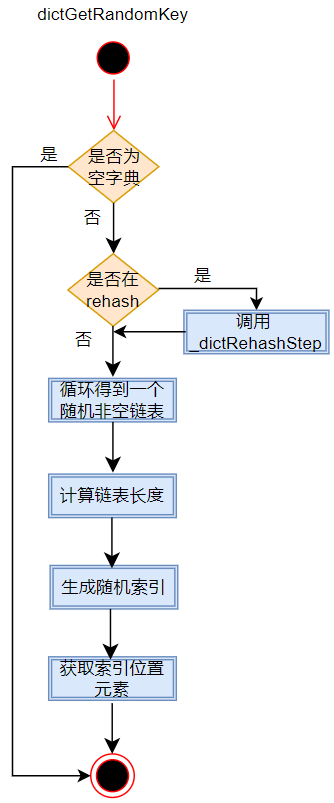
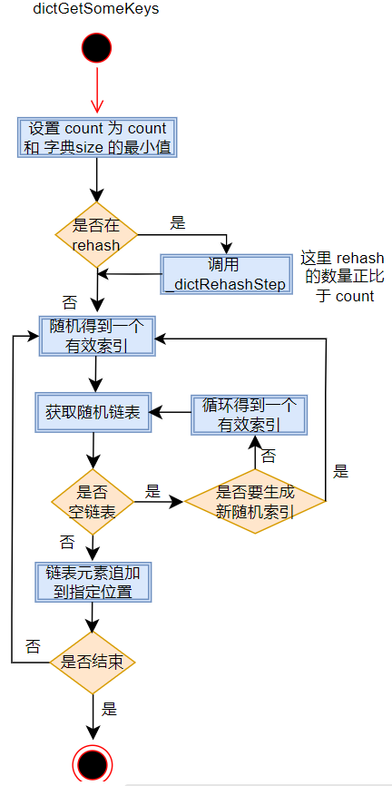
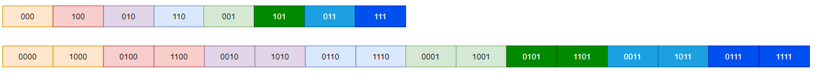
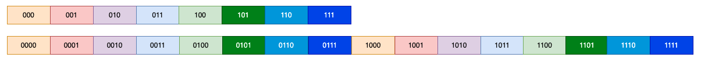
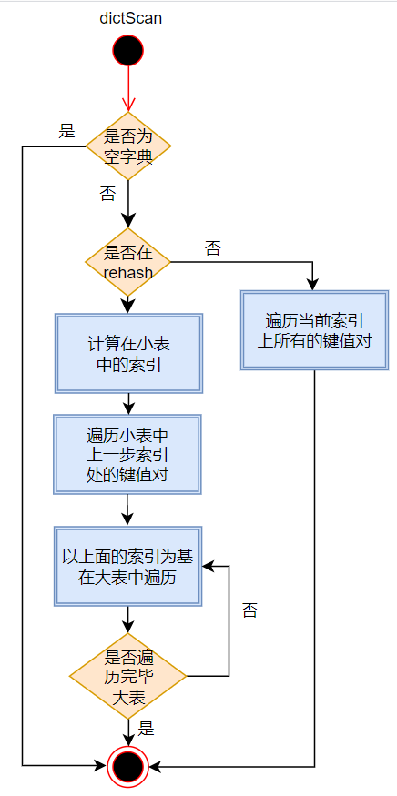

## 哈希

哈希恐怕是 redis 中最复杂的。

### 哈希结构


#### 哈希条目

```c
typedef struct dictEntry {
    void *key;
    union {
        void *val;
        uint64_t u64;
        int64_t s64;
        double d;
    } v; 
    struct dictEntry *next;
} dictEntry;
```

redis 中的哈希表使用桶 + 单向链表的方式实现，哈希值相同的键值对会存储在同一个链表上：

- key, 键对象，貌似都是 sds；
- v, 具体的值，不知道 union 下如何解析；
- next, 指向链表下一个节点；


#### 哈希函数

```c
typedef struct dictType {
    unsigned int (*hashFunction)(const void *key);
    void *(*keyDup)(void *privdata, const void *key);
    void *(*valDup)(void *privdata, const void *obj);
    int (*keyCompare)(void *privdata, const void *key1, const void *key2);
    void (*keyDestructor)(void *privdata, void *key);
    void (*valDestructor)(void *privdata, void *obj);
} dictType;
```

这个结构体中定义的都是一些函数指针，哈希表中用来计算哈希值、复制、比较等操作。


#### 哈希表

```c
typedef struct dictht {
    dictEntry **table;
    unsigned long size;
    unsigned long sizemask;
    unsigned long used;
} dictht;
```

哈希表存储所有的键值对，各参数意义如下：

- table, 这是一个数组，数组中每个元素指向一个 dictEntry 对象，进而存储在当前表大小下所有哈希值相同的键值对；
- size, 数组的大小，2 的幂次；
- sizemask, 用来计算一个键的掩码，大小为 size - 1，与 size 一起决定一个键值对应该存在 table 的哪个链表上；
- used, 表示已有的键值对数量，与 size 一起，决定字典的 rehash；


#### 字典

```c
typedef struct dict {
    dictType *type;
    void *privdata;
    dictht ht[2];
    long rehashidx; /* rehashing not in progress if rehashidx == -1 */
    int iterators; /* number of iterators currently running */
} dict;
```

各参数意义如下：

- type,  略；
- private, 略；
- ht, 一个两元素的数组；正常情况下，一个字典只使用0号哈希表，1号为空指针，但当发生 rehash 时，会两个都使用；
- rehashidx, 正常情况下为 -1，当发生 rehash 时，用来表示当前正在被 rehash 的是 0 号表中哪个索引；
- iterators, 略；


### rehash

redis 的字典，当键值对过多或过少时，会发生扩缩容；为了不严重阻塞对客户端的响应，redis 使用的是动态扩缩容；即每次都对若干键值对进行重排，通过少量多次的方式，最终实现字典的调整。

#### 扩容条件

```c
static int dict_can_resize = 1;
static unsigned int dict_force_resize_ratio = 5;
```

字典中通过上述两个变量控制扩容的发生。

redis 可以根据整体情况禁止扩容，但是如果键值对/表大小的比例超过阈值，还是会强制扩容。

redis 的扩容触发源码可以参考 _dictExpandIfNeeded 函数：

```c
static int _dictExpandIfNeeded(dict *d)
```


#### 扩缩容过程

当 redis 发现一个字典大小不适合时，就会调用 dictReszie 进行扩缩容；而它内部调用 dictExpand 函数，这个函数主要有三步操作：

- 求出下一个合适的表大小；
- 给表 1 开辟空间；
- 设置字典的 rehashidx 为 0，表示当前准备遍历的表 0 的桶索引；

之后，当对一个字典进行添加(dictAdd)、查找(dictFind)、删除(dictGenericDelete) 等操作时，redis 都会先判断字典是否正处在 rehash 中，如果是的话，会

调用 _dictRehashStep 函数，这个函数会迁移 h[0] 表中最多一个桶的所有键值对到 h[1] 中。这个过程会一直持续到桶中数据都迁移到表 1 中，然后执行如下四步重置：

- 释放表 0 ；
- 将表 0 指向新表；
- 重置表 1
- 设置字典的 rehashidx 为 -1；


### 随机键值对

字典中提供了三个函数用来返回随机键值对。

#### dictGetRandomKey

```c
dictEntry *dictGetRandomKey(dict *d)
```

该函数用来从字典中返回一个键值对，用在只需要返回一个键值对的场景下。

它的过程如下：




它的主要问题是，在获取元素时对同一个链表需要遍历两次。


#### dictGetSomeKeys

```c
unsigned int dictGetSomeKeys(dict *d, dictEntry **des, unsigned int count)
```

这个函数从字典中获取指定数量的键值对，并存储到指定的位置。

相对 dictGetRandomKey ，这个更快一些，因为它不需要遍历两次选中的链表；但它的随机分布并不好，因为在一个被选定的链表上，它会尝试把该链表的所有元素都选出来；另外该函数必须返回实际找到的键值对数量，因为有可能选中的键值对数量并没有达到指定的键值对数量。



#### dictScan

因为字典的动态扩缩容，导致字典的遍历是最复杂的。

任何遍历算法都必须满足以下两条条件：

- <font color=red>不能发生元素丢失(必备)；</font>
- 尽量减少重复遍历(可选);

[字典遍历]: https://blog.csdn.net/gqtcgq/article/details/50533336

redis 遍历字典时没有使用正序索引进行遍历，而是用了一个独特的算法。

首先需要注意的是，redis 中的 size 和 mask；当未扩缩容时，表 0 的 size 永远都是 2 的某个幂次方，而 mask 则永远等于 size - 1；如果发生扩缩容时，这个结论对表 1 也是成立的；所以当一个表发生扩缩容时，一个索引链表上键值对新的位置其实是可以预测的，比如一个索引为 00..00101 的链表，如果是扩容了 4 倍，那么其键值对新的索引的可以使用统一的格式表示:00..xx101, 其中 x 为 0 或者 1；缩容时也同样，只是这里是集中到一个新的索引上，而前面是分散开。


##### Pieter Noordhuis 算法

这个算法是这样的，它从 0 开始，操作完 0 处的数据后，不是从最低位进 1 ，而是从最高位进 1，即从高位到地位进制加 1，直到最后结果变为 0，处理结束。假设 size 是 8，然后发生了 2 倍的扩容，则索引变化如下：



这个变化中有一个地方需要注意，假设未扩容时索引在遍历顺序中的索引为 i，则扩容后新的位置必然为 2*i 和 2*i+1；而且这个结论可以扩展，及假设发生了 n 倍的扩容，则新的位置必然在  [i* n ,(i+1)* n) 之间。其中n==2<sup>k</sup>。

##### 扩容时的变量情况

还是以上图为例。

假设当前遍历的索引是 010；当 010 上的元素被遍历完毕后，正常下一步应该是 110；如果这时候发生了 2 倍的扩容，110 在新的遍历序列上就变成了 0110；

可以看到，扩容前， 000 100 110 已经被遍历过；而扩容后这些索引处的元素在扩容后的位置为 0000 1000 0100 1100 0010 1010，这正好是 0110 前面的位置，这些新位置处的元素均已经被遍历过且不会被再次遍历。即这时候不会发生重复遍历，更不会发生遍历丢失的情况。其实可以证明，当只发生扩容时，这样的遍历算法不会发生任何丢失元素和重复遍历的情况，这主要是因为一个处在原始序列 i 前面的任何一个元素，其扩容后的新位置都不可能达到 i 扩容后的位置。

##### 缩容时的遍历情况

缩容比较麻烦，因为缩容时可能会发生重复遍历，但绝对不会发生丢失元素的情况，且重复遍历的元素是比较确定的。

###### 不会重复遍历的情况

假设当前遍历的元素是 1100。遍历完毕后，下一个索引正常是 0010；这个值在缩容后的位置是 010.

未缩容时，遍历过的位置是 0000 1000 0100 1100，这些位置在缩容后的位置是 000 100，这些位置正好是 010 前面的位置，即不会发生丢失和重复的问题；

###### 会重复遍历的情况

假设当前遍历的元素是 0100。遍历完毕后，下一个索引正常是 1100；这个值在缩容后的位置是 100.

未缩容时，遍历过的位置是 0000 1000，这些位置在缩容后的位置是 000，这个位置正好是 100 前面的位置， 即 0000 1000 这些位置的元素不会被重复遍历，但是由于 0100 和 1100 映射的都是 100， 导致会重复遍历一次 0100 处的元素；但是只会重复遍历这一处，其它已遍历和未遍历过的并不会。

通过对上面两种情况的比对，可以得出结论并证明：

假设缩容前的 size 为 m，缩容后为 n，则重复遍历最多 m/n -1 处原索引处的键值对。证明如下：

假设缩容前的的索引为 i，其在缩容后的索引为 i1；下一个要遍历的索引为 j，其在缩容后的索引为 j1；

如果 i1 != j1，那么 i1必然小于j1，不会发生丢失和重复的情况；

如果 i1==j1，这时候对 j1 处的元素进行遍历，则会将原来在 i 处的元素也进行遍历；又知道，映射到 i1 处的老索引的范围为 [i1* k,(i1+1)*k)，其中 k==m/n，这个范围的索引数量是 k，而且只有是这个范围内最后一个索引值被遍历时发生缩容，才会导致这个范围内所有索引处的元素都要被遍历，因此重复遍历的索引值不会超过 m/n - 1。

##### 正序遍历的问题

还是假设扩缩容的倍数是 2，小的 size 是8，则正序的变化如下：



###### 扩容时的遍历情况

扩容时，不会发生丢失的情况，但会有严重的重复遍历情况。

假设正在遍历的索引是 010，下一个位置是 011. 扩容后，新的位置是 0011；扩容前，已经遍历过的索引为 000 001,他们扩容后在的索引是 0000 1000 0001 1001, 可以看到，1000 0001 1001 这三个位置都在 0011 的后面，会再次被遍历到，而且重复的数量比逆序时候要多。

###### 缩容时的遍历情况

当缩容时，不仅会重复遍历，更严重的是会丢失数据。

假设正在遍历的位置是 0100 ，下一个正常是 0101；缩容后，其新位置是 101；缩容前未遍历的位置是 0101 0110 0111 1000 1001 1010 1011 1100 1101 1110 1111，他们缩容后的位置是 101 110 111 000 001 010 011 100，这些位置中的 000 001 010 011 100 都在 101 之前，不可能再被遍历了，因此会丢失这些所引处的键值对信息；

此外缩容也会产生重复遍历，假设上图中 1100 被遍历完毕，下一个是 1101；缩容前遍历过的位置为 0000 0001 0010 0011 0100 0101 0110 0111 1000 1001 1010 1011 1100；缩容后的位置是 000 001 010 011 100 101 110 111，这些位置中 110 111 都在 101 后边，会被再次遍历到。


##### 遍历过程



基本过程就是上图这样：

- 首先判断是不是空字典，是的话直接返回 0，通知调用方结束；否则进行下一步；
- 判断是否在 rehash：
  - 如果没有，直接在表 0 中对索引处的键值对进行遍历；
  - 如果没有，则需要先对索引进行处理，得到该值在小表中的新索引，然后先在小表中对新索引处的键值对进行遍历；遍历结束后，到大表中对那些新位置处的键值对进行遍历；
- 通过算法得到下一个索引并返回给调用方；

源码中需要注意的地方有两处：

```c
...
do {
            /* Emit entries at cursor */
            de = t1->table[v & m1];
            while (de) {
                fn(privdata, de);
                de = de->next;
            }

            /* Increment bits not covered by the smaller mask */
            v = (((v | m0) + 1) & ~m0) | (v & m0); // 此时的 v 比 原来的 v 大 m0 + 1

            /* Continue while bits covered by mask difference is non-zero */
        } while (v & (m0 ^ m1)); // 似乎是计算出 m1 比 m0 扩张后的那些位置
...
```

证明如下：

​	假如 m0 的 1 有 x 位， m1 的 1 有 y 位；

​	设 a = v | m0, 这一步得到的结果中，低 x 位均为 1 ，而剩余的高位部分使用 v 相应的位值；

​    设 b = a + 1，由于a 的低 x 位均为 1，因此这一步的结果中，低 x 位均为 0， 剩余的高位为 a 高位部分加 1，然后抛弃进位 ； 

​    设 c =  ~m0，得到的结果中，低 x 为均为 0，而高位均为 1；

   设 d = b & c，得到的结果中，低 x 位均为0，高位则保留 b 的高位；这一步似乎并不需要

   设 e = v & m0, 得到的结果中，保留 v 的低 x 为，高位均为 0；

   设 f = d | e, 可以看到，它保留了 e 的低 x 位，保留了 d  高位；

  最后的结果其实就是保留 v 的低 x 位，高位 + 1；这个值再与 m0 | m1 的结果进行与操作，就可以得到 v 下一个位置的索引值。

```c
 ...
	v |= ~m0; // 得到的结果中，保留了 v 的低 x 位，高位全部为 1.

    /* Increment the reverse cursor */
    v = rev(v); // 整个数2进制翻转
    v++; // 逆序加1
    v = rev(v);// 再取反 
...
```

这个计算倒序 +1.


在3.2及以后，上面逻辑又被简化，变成：

```c
... 
do {
            /* Emit entries at cursor */
            de = t1->table[v & m1];
            while (de) {
                fn(privdata, de);
                de = de->next;
            }

            /* Increment the reverse cursor not covered by the smaller mask.*/
            v |= ~m1; // v 的高位全部为1，低位保留
            v = rev(v);
            v++; // 高位加1
            v = rev(v);

            /* Continue while bits covered by mask difference is non-zero */
        } while (v & (m0 ^ m1));
	}

return v;
```

即严格按照上面的思路来。
