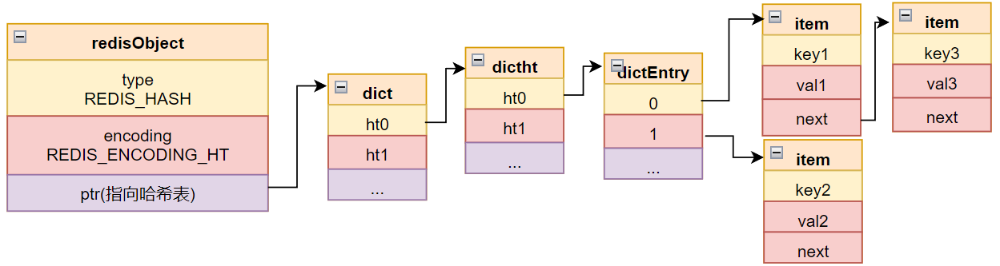

## 哈希

哈希恐怕是 redis 中最复杂的。

### 哈希结构



#### 哈希条目

```c
typedef struct dictEntry {
    void *key;
    union {
        void *val;
        uint64_t u64;
        int64_t s64;
        double d;
    } v; 
    struct dictEntry *next;
} dictEntry;
```

redis 中的哈希表使用桶 + 单向链表的方式实现，哈希值相同的键值对会存储在同一个链表上：

- key, 键对象，貌似都是 sds；
- v, 具体的值，不知道 union 下如何解析；
- next, 指向链表下一个节点；


#### 哈希函数

```c
typedef struct dictType {
    unsigned int (*hashFunction)(const void *key);
    void *(*keyDup)(void *privdata, const void *key);
    void *(*valDup)(void *privdata, const void *obj);
    int (*keyCompare)(void *privdata, const void *key1, const void *key2);
    void (*keyDestructor)(void *privdata, void *key);
    void (*valDestructor)(void *privdata, void *obj);
} dictType;
```

这个结构体中定义的都是一些函数指针，哈希表中用来计算哈希值、复制、比较等操作。


#### 哈希表

```c
typedef struct dictht {
    dictEntry **table;
    unsigned long size;
    unsigned long sizemask;
    unsigned long used;
} dictht;
```

哈希表存储所有的键值对，各参数意义如下：

- table, 这是一个数组，数组中每个元素指向一个 dictEntry 对象，进而存储在当前表大小下所有哈希值相同的键值对；
- size, 数组的大小，2 的幂次；
- sizemask, 用来计算一个键的掩码，大小为 size - 1，与 size 一起决定一个键值对应该存在 table 的哪个链表上；
- used, 表示已有的键值对数量，与 size 一起，决定字典的 rehash；


#### 字典

```c
typedef struct dict {
    dictType *type;
    void *privdata;
    dictht ht[2];
    long rehashidx; /* rehashing not in progress if rehashidx == -1 */
    int iterators; /* number of iterators currently running */
} dict;
```

各参数意义如下：

- type,  略；
- private, 略；
- ht, 一个两元素的数组；正常情况下，一个字典只使用0号哈希表，1号为空指针，但当发生 rehash 时，会两个都使用；
- rehashidx, 正常情况下为 -1，当发生 rehash 时，用来表示当前正在被 rehash 的是 0 号表中哪个索引；
- iterators, 略；


### rehash

redis 的字典，当键值对过多或过少时，会发生扩缩容；为了不严重阻塞对客户端的响应，redis 使用的是动态扩缩容；即每次都对若干键值对进行重排，通过少量多次的方式，最终实现字典的调整。

#### 扩容条件

```c
static int dict_can_resize = 1;
static unsigned int dict_force_resize_ratio = 5;
```

字典中通过上述两个变量控制扩容的发生。

redis 可以根据整体情况禁止扩容，但是如果键值对/表大小的比例超过阈值，还是会强制扩容。

redis 的扩容触发源码可以参考 _dictExpandIfNeeded 函数：

```c
static int _dictExpandIfNeeded(dict *d)
```


#### 扩缩容过程

