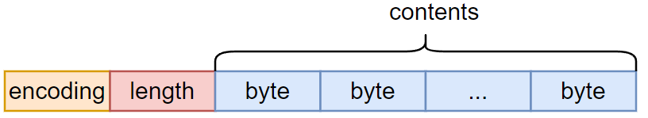
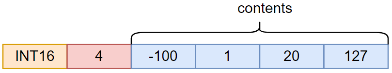
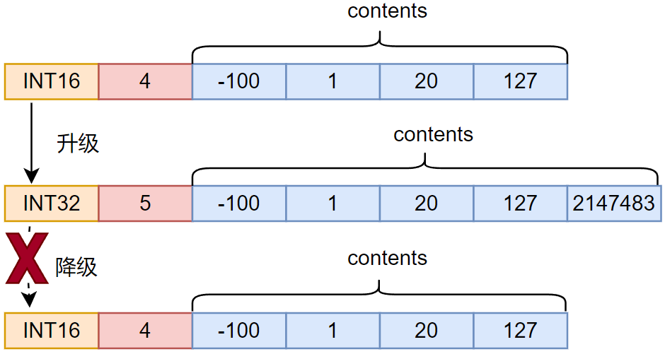
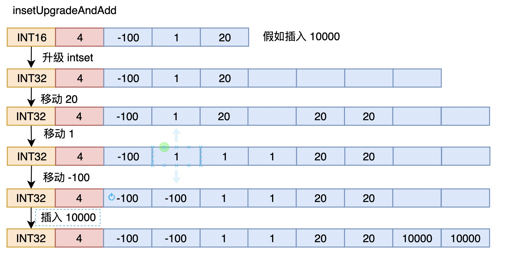

注：intset 部分根据 redis 源码中 3.0.0 进行解析，commit id 为 8ebae5d63 .

## 整数集合

整数集合是 redis 的底层数据结构之一，主要用于集合，如果集合中的所有元素都是整数，redis 有可能使用整数集合作为底层结构。

### 结构体定义

```c
typedef struct intset {
    uint32_t encoding;
    uint32_t length;
    int8_t contents[];
} intset;
```



各字段含义如下：

- encoding, 表示集合中每个元素的类型；整数集合中每个元素占用字节数相同，但不同时刻该大小可能不同，该字段指明当前每个元素的大小，包括16 位、32  位、64 位，均为有符号类型；
- length, 表示集合中元素的数量；
- contents, 这是一个字节数组，虽然声明为 int8, 但其真正的意义需要根据 encoding 来解释；

需要注意以下几点：

- 整数集合中的元素是有序的，这样方便使用二分法进行查找；

  

- 如果新加入集合的元素使用的字节数比集合当前单元素占用的大，则集合会发生升级，每个元素占用的字节数均达到新元素的字节数量；

- 集合不会发生降级，即使所有元素都不需要这么多空间；

- intset 中的元素是单调递增的，不会有重复元素；




### 整数集合函数

#### _intsetGetEncoded

这个函数如下：

```c
static int64_t _intsetGetEncoded(intset *is, int pos, uint8_t enc) {
    int64_t v64;
    int32_t v32;
    int16_t v16;

    if (enc == INTSET_ENC_INT64) {
        memcpy(&v64,((int64_t*)is->contents)+pos,sizeof(v64)); 
        memrev64ifbe(&v64);// 处理大小端问题
        return v64;
    } else if (enc == INTSET_ENC_INT32) {
        memcpy(&v32,((int32_t*)is->contents)+pos,sizeof(v32));
        memrev32ifbe(&v32);
        return v32;
    } else {
        memcpy(&v16,((int16_t*)is->contents)+pos,sizeof(v16));
        memrev16ifbe(&v16);
        return v16;
    }
}
```

该函数获取集合中指定索引的数值，而且获取后还会处理大小端问题，整数集合中貌似元素的存储都是按照小端模式存储的；

**问题 如果是考虑数据的可移植性，为什么 sds 中看不到对 alloc 和 len 的大小端处理，而在 intset 中，除了 contents 部分外，连 encoding 和 length 都需要考虑大小端？？？？？**


#### intsetNew

```c
intset *intsetNew(void) {
    intset *is = zmalloc(sizeof(intset));
    is->encoding = intrev32ifbe(INTSET_ENC_INT16);
    is->length = 0;
    return is;
}
```

生成一个新的集合对象，可以看到，初始时每个元素都按照 2 字节大小进行设置。


#### intsetSearch

```c
static uint8_t intsetSearch(intset *is, int64_t value, uint32_t *pos) {
    int min = 0, max = intrev32ifbe(is->length)-1, mid = -1;
    int64_t cur = -1;

    /* The value can never be found when the set is empty */
    if (intrev32ifbe(is->length) == 0) {
        if (pos) *pos = 0;
        return 0;
    } else {
        /* Check for the case where we know we cannot find the value,
         * but do know the insert position. */
        if (value > _intsetGet(is,intrev32ifbe(is->length)-1)) {
            if (pos) *pos = intrev32ifbe(is->length);
            return 0;
        } else if (value < _intsetGet(is,0)) {
            if (pos) *pos = 0;
            return 0;
        }
    }

    while(max >= min) {
        mid = ((unsigned int)min + (unsigned int)max) >> 1;
        cur = _intsetGet(is,mid);
        if (value > cur) {
            min = mid+1;
        } else if (value < cur) {
            max = mid-1;
        } else {
            break;
        }
    }

    if (value == cur) {
        if (pos) *pos = mid;
        return 1;
    } else {
        if (pos) *pos = min;
        return 0;
    }
}
```

这个函数用来从整数集合中查找一个给定的数据，如果存在，就返回它在集合中的索引；如果没有找到，就返回它可以插入的位置。


#### intsetUpgradeAndAdd

```c
static intset *intsetUpgradeAndAdd(intset *is, int64_t value) {
    uint8_t curenc = intrev32ifbe(is->encoding);
    uint8_t newenc = _intsetValueEncoding(value);
    int length = intrev32ifbe(is->length);
    int prepend = value < 0 ? 1 : 0;

    /* First set new encoding and resize */
    is->encoding = intrev32ifbe(newenc);
    is = intsetResize(is,intrev32ifbe(is->length)+1);

    /* Upgrade back-to-front so we don't overwrite values.
     * Note that the "prepend" variable is used to make sure we have an empty
     * space at either the beginning or the end of the intset. */
    while(length--)
        _intsetSet(is,length+prepend,_intsetGetEncoded(is,length,curenc)); // 这里要注意，用的是老的 encoding

    /* Set the value at the beginning or the end. */
    if (prepend)
        _intsetSet(is,0,value);
    else
        _intsetSet(is,intrev32ifbe(is->length),value);
    is->length = intrev32ifbe(intrev32ifbe(is->length)+1);
    return is;
}
```

集合大小升级并添加新元素。

这里比较有意思的地方在于，升级后，需要移动数据；而导致升级的数据一定是在新集合的头部或者尾部，因此这里使用从后往前迁移数据的方式，解决数据被覆盖的问题；此外，要注意的是，调用 _intsetGetEncoded 时，用的是老的 encoding。

上面的操作过程如下图：



#### intsetAdd

```c
intset *intsetAdd(intset *is, int64_t value, uint8_t *success) {
    uint8_t valenc = _intsetValueEncoding(value);
    uint32_t pos;
    if (success) *success = 1;

    /* Upgrade encoding if necessary. If we need to upgrade, we know that
     * this value should be either appended (if > 0) or prepended (if < 0),
     * because it lies outside the range of existing values. */
    if (valenc > intrev32ifbe(is->encoding)) {
        /* This always succeeds, so we don't need to curry *success. */
        return intsetUpgradeAndAdd(is,value);
    } else {
        /* Abort if the value is already present in the set.
         * This call will populate "pos" with the right position to insert
         * the value when it cannot be found. */
        if (intsetSearch(is,value,&pos)) {
            if (success) *success = 0;
            return is;
        }

        is = intsetResize(is,intrev32ifbe(is->length)+1);
        if (pos < intrev32ifbe(is->length)) intsetMoveTail(is,pos,pos+1);
    }

    _intsetSet(is,pos,value);
    is->length = intrev32ifbe(intrev32ifbe(is->length)+1);
    return is;
}
```

向集合中添加数值的函数，整个函数逻辑如下：


#### intsetRemove

```c
intset *intsetRemove(intset *is, int64_t value, int *success) {
    uint8_t valenc = _intsetValueEncoding(value);
    uint32_t pos;
    if (success) *success = 0;

    if (valenc <= intrev32ifbe(is->encoding) && intsetSearch(is,value,&pos)) {
        uint32_t len = intrev32ifbe(is->length);

        /* We know we can delete */
        if (success) *success = 1;

        /* Overwrite value with tail and update length */
        if (pos < (len-1)) intsetMoveTail(is,pos+1,pos);
        is = intsetResize(is,len-1);
        is->length = intrev32ifbe(len-1);
    }
    return is;
}
```

从集合中删除一个数值，成功失败通过 success 指针指明。基本逻辑就是先查看要删除的数值的 encoding 是否不超过当前 intset 的encoding，因为过大的话，intset 中肯定没有 value，可以直接返回；然后再查看 value 是否存在于 intset 中，存在的话，将 value 后面的所有元素往前移动一个位置，然后缩减 intset 的空间，更改 length；可以看到，即使删除的元素是唯一占用大空间的元素，也不会发生 encoding 降级的情况。

