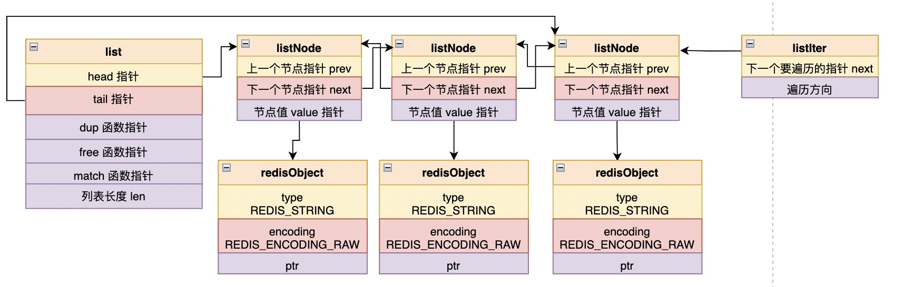

注：list 部分根据 redis 源码中 3.0.0 进行解析，commit id 为 8ebae5d63 .

Redis 中的列表本质上是传统的双向链表。


## 列表定义

```c
// adlist.h
typedef struct listNode {
    struct listNode *prev;
    struct listNode *next;
    void *value;
} listNode;

typedef struct listIter {
    listNode *next;
    int direction;
} listIter;

typedef struct list {
    listNode *head;
    listNode *tail;
    void *(*dup)(void *ptr);
    void (*free)(void *ptr);
    int (*match)(void *ptr, void *key);
    unsigned long len;
} list;
```

链表中主要有三个结构体：

- listNode 定义了列表中每个节点的信息，可以看到这是个双向链表节点；

- list 定义了列表结构体，负责具体的对外工作，当然这个结构体也有一些辅助性的函数指针作为属性；

- listIter, 对链表进行遍历时候使用；

  


## 列表函数

### listCreate

#### 函数原型

```c
// adlist.c
list *listCreate(void)
{
    struct list *list;

    if ((list = zmalloc(sizeof(*list))) == NULL)
        return NULL;
    list->head = list->tail = NULL;
    list->len = 0;
    list->dup = NULL;
    list->free = NULL;
    list->match = NULL;
    return list;
}
```

这个函数主要负责生成一个新的 list 结构体，并初始化其头尾指针、数量，将几个函数指针均置为空。


### listRelease

#### 函数原型

```c
// adlist.c
void listRelease(list *list)
{
    unsigned long len;
    listNode *current, *next;

    current = list->head;
    len = list->len;
    while(len--) {
        next = current->next;
        if (list->free) list->free(current->value);
        zfree(current);
        current = next;
    }
    zfree(list);
}
```

这个函数用来释放列表中的每个节点，并在最后释放整个列表结构体。这里调用了结构体的 free 指针。


### listAddNodeHead

#### 函数原型

```c
// adlist.c
list *listAddNodeHead(list *list, void *value)
{
    listNode *node;

    if ((node = zmalloc(sizeof(*node))) == NULL)
        return NULL;
    node->value = value;
    if (list->len == 0) {
        list->head = list->tail = node;
        node->prev = node->next = NULL;
    } else {
        node->prev = NULL;
        node->next = list->head;
        list->head->prev = node;
        list->head = node;
    }
    list->len++;
    return list;
}
```

这个函数向列表头部添加节点，不过需要注意的是，虽然在操作过程中，list 本身不会更改内存区域，但函数还是返回了这个指针而不是 void, 目测是为了区分添加操作是否成功。


### listAddNodeTail

#### 函数原型

```c
// adlist.c
list *listAddNodeTail(list *list, void *value)
{
    listNode *node;

    if ((node = zmalloc(sizeof(*node))) == NULL)
        return NULL;
    node->value = value;
    if (list->len == 0) {
        list->head = list->tail = node;
        node->prev = node->next = NULL;
    } else {
        node->prev = list->tail;
        node->next = NULL;
        list->tail->next = node;
        list->tail = node;
    }
    list->len++;
    return list;
}
```

同上，不过这个函数是将节点添加到列表尾部。


### listInsertNode

#### 函数原型

```c
// adlist.c
list *listInsertNode(list *list, listNode *old_node, void *value, int after) {
    listNode *node;

    if ((node = zmalloc(sizeof(*node))) == NULL)
        return NULL;
    node->value = value;
    if (after) {
        node->prev = old_node;
        node->next = old_node->next;
        if (list->tail == old_node) {
            list->tail = node;
        }
    } else {
        node->next = old_node;
        node->prev = old_node->prev;
        if (list->head == old_node) {
            list->head = node;
        }
    }
    if (node->prev != NULL) {
        node->prev->next = node;
    }
    if (node->next != NULL) {
        node->next->prev = node;
    }
    list->len++;
    return list;
}
```

这个函数用来向列表中指定节点前或后插入元素；

当 after 为 0 时，新节点在 old_node 前边，否则在后边；


### listDelNode

#### 函数原型

```c
// adlist.c
void listDelNode(list *list, listNode *node)
{
    if (node->prev)
        node->prev->next = node->next;
    else
        list->head = node->next;
    if (node->next)
        node->next->prev = node->prev;
    else
        list->tail = node->prev;
    if (list->free) list->free(node->value);
    zfree(node);
    list->len--;
}
```

从指定列表中删除指定节点，并释放相关内存。


### listGetIterator

#### 函数原型

```c
// adlist.c
listIter *listGetIterator(list *list, int direction)
{
    listIter *iter;

    if ((iter = zmalloc(sizeof(*iter))) == NULL) return NULL;
    if (direction == AL_START_HEAD)
        iter->next = list->head;
    else
        iter->next = list->tail;
    iter->direction = direction;
    return iter;
}
```

对一个列表生成一个迭代器，这个迭代器由 directiron 指定迭代方向，0 表示从表头开始，非 0 表示逆序。


### listReleaseIterator

#### 函数原型

```c
// adlist.c
void listReleaseIterator(listIter *iter) {
    zfree(iter);
}
```

释放整个迭代器结构体。


### listRewind listRewindTail

#### 函数原型

```c
// adlist.c
void listRewind(list *list, listIter *li) {
    li->next = list->head;
    li->direction = AL_START_HEAD;
}

void listRewindTail(list *list, listIter *li) {
    li->next = list->tail;
    li->direction = AL_START_TAIL;
}
```

这两个函数主要是在一个迭代器内部，强制性改变一个迭代器从旧列表指向新列表。


### listNext

#### 函数原型

```c
// adlist.c
listNode *listNext(listIter *iter)
{
    listNode *current = iter->next;

    if (current != NULL) {
        if (iter->direction == AL_START_HEAD)
            iter->next = current->next;
        else
            iter->next = current->prev;
    }
    return current;
}
```

从迭代器中返回下一个节点。


### listDup

#### 函数原型

```c
// adlist.c
list *listDup(list *orig)
{
    list *copy;
    listIter *iter;
    listNode *node;

    if ((copy = listCreate()) == NULL)
        return NULL;
    copy->dup = orig->dup;
    copy->free = orig->free;
    copy->match = orig->match;
    iter = listGetIterator(orig, AL_START_HEAD);
    while((node = listNext(iter)) != NULL) {
        void *value;

        if (copy->dup) {
            value = copy->dup(node->value);
            if (value == NULL) {
                listRelease(copy);
                listReleaseIterator(iter);
                return NULL;
            }
        } else
            value = node->value;
        if (listAddNodeTail(copy, value) == NULL) {
            listRelease(copy);
            listReleaseIterator(iter);
            return NULL;
        }
    }
    listReleaseIterator(iter);
    return copy;
}
```

基于一个列表复制出一个新的列表，它内部实现的过程中，用到了列表的 dup 函数指针，遍历过程则使用一个列表迭代对象正序迭代。


### listSearchKey

#### 函数原型

```c
// adlist.c
listNode *listSearchKey(list *list, void *key)
{
    listIter *iter;
    listNode *node;

    iter = listGetIterator(list, AL_START_HEAD);
    while((node = listNext(iter)) != NULL) {
        if (list->match) {
            if (list->match(node->value, key)) {
                listReleaseIterator(iter);
                return node;
            }
        } else {
            if (key == node->value) {
                listReleaseIterator(iter);
                return node;
            }
        }
    }
    listReleaseIterator(iter);
    return NULL;
}
```

在列表中查找是否有节点与给定的 key 相等，这个函数内部同样使用了列表的 match 函数指针和一个正序列表迭代对象。


### listIndex

#### 函数原型

```c
// adlist.c
listNode *listIndex(list *list, long index) {
    listNode *n;

    if (index < 0) {
        index = (-index)-1;
        n = list->tail;
        while(index-- && n) n = n->prev;
    } else {
        n = list->head;
        while(index-- && n) n = n->next;
    }
    return n;
}
```

这个函数返回列表中指定索引的节点，从 0 开始计数，支持负索引，负索引表示从列表尾部开始查找指定索引的节点；


### void listRotate(list *list)

#### 函数原型

```c
// adlist.c
void listRotate(list *list) {
    listNode *tail = list->tail;

    if (listLength(list) <= 1) return;

    /* Detach current tail */
    list->tail = tail->prev;
    list->tail->next = NULL;
    /* Move it as head */
    list->head->prev = tail;
    tail->prev = NULL;
    tail->next = list->head;
    list->head = tail;
}
```

这个函数将一个列表中的最后一个元素移动到列表头。