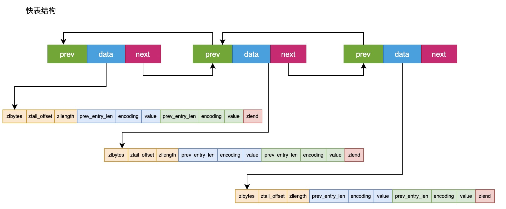
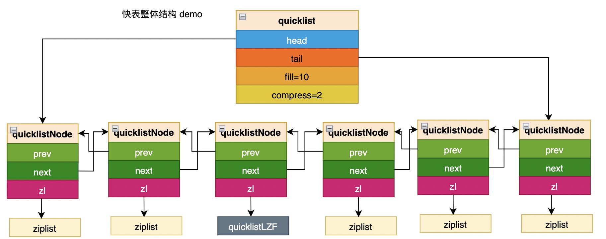

注：quicklist 部分根据 redis 源码中 3.2.0 进行解析，commit id 为 7ca8fbabe .


## 快表是什么

list 是 redis 最基础的数据类型之一；它的优点和缺点很明显：优点是它的双端操作很方便，但是每个节点都需要 prev 和 next 指针维持链表，而且节点内存是随机分布的，可能会导致明显的内存碎片，空间局部性也不太好。

在 redis 3.2 中引入了快表这种数据结构，它是 list 和 zip 两者结合的产物，它整体是一个 list，而每个节点则是一个 zip 节点。



## 快表结构体

```c
//quicklist.h
typedef struct quicklistNode {
    struct quicklistNode *prev;
    struct quicklistNode *next;
    unsigned char *zl; //取决于节点位置，可能指向一个真正的 ziplist，也可能指向一个压缩后的 ziplist
    unsigned int sz;             /* ziplist size in bytes */ //zl 指向的 ziplist 大小，如果 ziplist 被压缩，也是压缩前的大小。
    unsigned int count : 16;     /* count of items in ziplist */
    unsigned int encoding : 2;   /* RAW==1 or LZF==2 */ // ziplist 是否被压缩以及压缩算法，固定为 1 没有压缩，2 使用 LZF 压缩。
    unsigned int container : 2;  /* NONE==1 or ZIPLIST==2 */ // 暂时没用，值固定为 2.
    unsigned int recompress : 1; /* was this node previous compressed? */ 
    unsigned int attempted_compress : 1; /* node can't compress; too small */
    unsigned int extra : 10; /* more bits to steal for future usage */
} quicklistNode;

typedef struct quicklistLZF {
    unsigned int sz; /* LZF size in bytes*/ // compressed 占用的总大小。
    char compressed[];
} quicklistLZF;

typedef struct quicklist {
    quicklistNode *head;
    quicklistNode *tail;
    unsigned long count;        /* total count of all entries in all ziplists */
    unsigned int len;           /* number of quicklistNodes */
    int fill : 16;              /* fill factor for individual nodes */ // ziplist 的大小，正负表示的意义不同。
    unsigned int compress : 16; /* depth of end nodes not to compress;0=off */ // 表示两端各自有几个节点不用压缩。
} quicklist;

typedef struct quicklistIter {
    const quicklist *quicklist;
    quicklistNode *current;
    unsigned char *zi; 
    long offset; /* offset in current ziplist */
    int direction;
} quicklistIter;

typedef struct quicklistEntry {
    const quicklist *quicklist;
    quicklistNode *node;
    unsigned char *zi;
    unsigned char *value;
    unsigned int sz;
    long long longval;
    int offset;
} quicklistEntry;
```

zip 本身已经很复杂了，快表是在 zip 的基础上又进行了封装，结构更复杂。

### quicklistNode

quicklistNode，它等价于list 的 node：

- prev 和 next，双向链表的指针；
- zl，指向 node 表示的 zip 数据；出于性能考虑，快表的部分节点会被压缩，因此 zl 指向的 zip 可能是一个真正的 zip，但也可能是一个压缩后的 zip，即下面的 quicklistLZF 类型，处理时要注意；
- sz，zip 数据的长度，指的是压缩前的大小；
- count，一个 zip 中包含的节点数量；
- encoding，1 表示没有压缩，2 表示压缩了，压缩算法目前是固定的；
- recompress，节点之前是否被压缩过；


### quicklistLZF

它表示一个被压缩过的 zip 节点：

- sz，压缩后的数组大小；
- compressed，柔性数组，存放压缩后的字节数组；

### quicklist

quicklist，它表示快表的整体结构：

- head 和 tail，快表的头节点和尾节点；
- count，快表中所有 zip 节点的数量；
- len, 快表的节点数量；
- fill，用来表示每个 ziplist 的大小；
- compress，表示快表两端各自有多少个节点不用压缩，因为链表中的操作，往往是两端的操作比较频繁，所以快表允许对两端的节点不做压缩，如 compress=2，则表示快表头上的两个节点和尾部的两个节点都不用压缩；

这里要单独对 fill 解释一下，fill 属于有符号整数的一部分，它的值可正可负，正负代表的含义是不同的。

如果是正数，则表示每个 ziplist 最多包含的数据项数；

如果是负数，只能取 5 个值：

- -1，ziplist 不超过 4k；
- -2，ziplist 不超过 8k；
- -3，ziplist 不超过 16k；
- -4，ziplist 不超过 32k；
- -5，ziplist 不超过 64k；





## 快表函数

### 查询指定索引处的元素

```c
int quicklistIndex(const quicklist *quicklist, const long long idx,
                   quicklistEntry *entry) {
    quicklistNode *n;
    unsigned long long accum = 0;
    unsigned long long index;
    int forward = idx < 0 ? 0 : 1; /* < 0 -> reverse, 0+ -> forward */

    initEntry(entry);
    entry->quicklist = quicklist;

    if (!forward) {
        index = (-idx) - 1;
        n = quicklist->tail;
    } else {
        index = idx;
        n = quicklist->head;
    }

    if (index >= quicklist->count)
        return 0;

    while (likely(n)) {
        if ((accum + n->count) > index) {
            break;
        } else {
            D("Skipping over (%p) %u at accum %lld", (void *)n, n->count,
              accum);
            accum += n->count;
            n = forward ? n->next : n->prev;
        }
    }

    if (!n)
        return 0;

    D("Found node: %p at accum %llu, idx %llu, sub+ %llu, sub- %llu", (void *)n,
      accum, index, index - accum, (-index) - 1 + accum);

    entry->node = n;
    if (forward) {
        /* forward = normal head-to-tail offset. */
        entry->offset = index - accum;
    } else {
        /* reverse = need negative offset for tail-to-head, so undo
         * the result of the original if (index < 0) above. */
        entry->offset = (-index) - 1 + accum;
    }

    quicklistDecompressNodeForUse(entry->node);
    entry->zi = ziplistIndex(entry->node->zl, entry->offset);
    ziplistGet(entry->zi, &entry->value, &entry->sz, &entry->longval);
    /* The caller will use our result, so we don't re-compress here.
     * The caller can recompress or delete the node as needed. */
    return 1;
}
```


这个函数找到快表上指定索引位置处的元素，并添加到 entry 中，同样支持负索引。

相对列表和压缩表中的功能，快表查找的麻烦在于，每个节点的元素数量不固定，需要从头或者尾部，一个一个节点的读取当前节点的元素数量，一旦发现索引指定的元素在该节点上，再将该节点按照压缩表节点进行处理；但是在遍历该节点之前，还要先对该节点进行解压缩处理。


### 头部插入新元素

```c
int quicklistPushHead(quicklist *quicklist, void *value, size_t sz) {
    quicklistNode *orig_head = quicklist->head;
    if (likely(
            _quicklistNodeAllowInsert(quicklist->head, quicklist->fill, sz))) { // 允许节点插入
        quicklist->head->zl =
            ziplistPush(quicklist->head->zl, value, sz, ZIPLIST_HEAD);
        quicklistNodeUpdateSz(quicklist->head);
    } else {
        quicklistNode *node = quicklistCreateNode();
        node->zl = ziplistPush(ziplistNew(), value, sz, ZIPLIST_HEAD);

        quicklistNodeUpdateSz(node);
        _quicklistInsertNodeBefore(quicklist, quicklist->head, node); // 会在当前 head 节点的前面新建一个节点存储新的 entry，同时更新快表的 head。
    }
    quicklist->count++;
    quicklist->head->count++;
    return (orig_head != quicklist->head);
}
```

在快表头部插入一个新节点，主要麻烦的地方在于，当前头部节点可能已经太大或者太长了，插入时需要先判断当前头节点是否还允许插入节点；如果不允许的话，就会在开头直接开辟一个新的快表节点出来。

尾部插入新元素逻辑基本相同。


### 更改指定索引处的元素

```c
int quicklistReplaceAtIndex(quicklist *quicklist, long index, void *data,
                            int sz) {
    quicklistEntry entry;
    if (likely(quicklistIndex(quicklist, index, &entry))) {
        /* quicklistIndex provides an uncompressed node */
        entry.node->zl = ziplistDelete(entry.node->zl, &entry.zi);
        entry.node->zl = ziplistInsert(entry.node->zl, entry.zi, data, sz);
        quicklistCompress(quicklist, entry.node);
        return 1;
    } else {
        return 0;
    }
}
```

这个函数就是不停调用既有的 api，先找到元素，然后调用删除元素的接口将元素删除，最后再调用插入接口将新的元素插入进去。