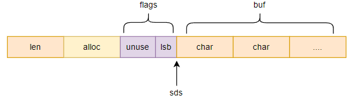

## sds 的五种头

### 结构体声明

```c
// sds.h
typedef char *sds;

/* Note: sdshdr5 is never used, we just access the flags byte directly.
 * However is here to document the layout of type 5 SDS strings. */
struct __attribute__ ((__packed__)) sdshdr5 {
    unsigned char flags; /* 3 lsb of type, and 5 msb of string length */
    char buf[];
};
struct __attribute__ ((__packed__)) sdshdr8 {
    uint8_t len; /* used */
    uint8_t alloc; /* excluding the header and null terminator */
    unsigned char flags; /* 3 lsb of type, 5 unused bits */
    char buf[];
};
struct __attribute__ ((__packed__)) sdshdr16 {
    uint16_t len; /* used */
    uint16_t alloc; /* excluding the header and null terminator */
    unsigned char flags; /* 3 lsb of type, 5 unused bits */
    char buf[];
};
struct __attribute__ ((__packed__)) sdshdr32 {
    uint32_t len; /* used */
    uint32_t alloc; /* excluding the header and null terminator */
    unsigned char flags; /* 3 lsb of type, 5 unused bits */
    char buf[];
};
struct __attribute__ ((__packed__)) sdshdr64 {
    uint64_t len; /* used */
    uint64_t alloc; /* excluding the header and null terminator */
    unsigned char flags; /* 3 lsb of type, 5 unused bits */
    char buf[];
};
```

可以看到， sds 共声明了五种头结构体，不同的头其字符串部分长度不同，sds5 的使用比较特殊，另外四种用法一致。

### sds 头结构

除了 sds5 之外的其它四种，它们都使用了类似下面的结构：




#### len

len 表示 sds 结构中已经被使用的字节数；

#### alloc

alloc 表示 sds 结构中分配的总字节数；

#### flags

flags 是一个单字节的字段，使用的只有最低的 3 位，用来表示 sds 头是上面四种中的哪一种。


#### sds5 

sds5 不太一样，它没有 len 和 alloc 部分，它的 flags 字段中，高位的 5 位会用来标记字符串部分的字节数。


## sds 宏定义

除了使用宏定义不同的类型外，目前看到的 sds 中比较重要的宏定义包括以下三个：

```c
#define SDS_HDR_VAR(T,s) struct sdshdr##T *sh = (void*)((s)-(sizeof(struct sdshdr##T)));
```

SDS_HDR_VAR ，根据给定的 sds 结构体，查找对应结构体正确的起始地址，并构建出一个有固定名称的 sh 变量；

```c
#define SDS_HDR(T,s) ((struct sdshdr##T *)((s)-(sizeof(struct sdshdr##T))))
```

类似上面，获取一个 sds 真实的起始指针；

sds 中有几个内联函数，对 sds 的头进行操作，如获取长度的 sdslen、获取可用空间的 sdsavail、设置长度的 sdssetlen 等，这些函数内部都是通过 SDS_HDR 先获取到 sds 的起始地址后，再获取 len 或者 alloc 字段实现功能；

```c
#define SDS_TYPE_5_LEN(f) ((f)>>SDS_TYPE_BITS)
```

获取 sds5 的字符串字节数；


## sds 函数

### sdsnewlen

#### 函数原型

```c
sds sdsnewlen(const void *init, size_t initlen)
```

#### 函数功能

这个函数根据传入的 init 指针和给定的 initlen 长度，构建一个新的 sds 结构体；

需要注意的地方有两个：

- 尽量不使用 sds5，作者认为，如果 initlen 为 0，那么这个 sds 往往是用来进行追加的，而 sds5 没有额外空间，因此 sds5 都会被重置为 sds8；
- 当字符串部分用 init 初始化完毕后，会在末尾追加一个 '\0'，与 c 的字符串兼容；


这个函数会被 sds 中多个函数调用：

- 用空字符串生成一个新的 sds 结构 (sdsempty 函数)；
- 用非空字符串生成一个新的 sds 结构 (sdsnew函数)；
- 用既有 sds 复制一个内容完全一样的新的 sds 结构 (sdsdup函数)；


### sdsfree

#### 函数原型

```c
void sdsfree(sds s) {
    if (s == NULL) return;
    s_free((char*)s-sdsHdrSize(s[-1]));
}
```

#### 函数功能

根据给定的 sds，释放整个结构体内存；


### sdsclear

#### 函数原型

```c
void sdsclear(sds s) {
    sdssetlen(s, 0);
    s[0] = '\0';
}
```

#### 函数功能

将 sds 的 len 设置为 0，但不清除分配的任何空间；


### sdsMakeRoomFor

#### 函数原型

```c
sds sdsMakeRoomFor(sds s, size_t addlen)
```

#### 函数功能

当需要向一个既有的 sds 结构体追加文本时，需要先使用该函数，它被调用成功后，会保证新的 sds 中有至少 addlen 个自由空间字节来容纳新串。

需要注意三点：

- 如果结构中自由空间大小大于 addlen，则不会执行扩容，而是直接返回原来的 s；
- 如果执行了扩容，会返回全新的内存区域，原来的 s 指向的空间会被释放；
- 扩容时，不仅仅是保证新空间有至少 addlen 个自由空间，如果新的 len 不超过 1 M, 会 len 翻倍后才扩容，而超过的话，会保证 len 后还有 1 M 的自由空间；


### sdsRemoveFreeSpace

#### 函数原型

```c
sds sdsRemoveFreeSpace(sds s)
```

#### 函数功能

该函数会移除 sds 末尾所有的自由空间，释放原结构体并返回新的结构体；


### sdscat

#### 函数原型

```c
sds sdscat(sds s, const char *t) {
    return sdscatlen(s, t, strlen(t));
}
```

#### 功能


### sdscatsds

将一个 c 字符串追加到一个 sds 中。

#### 函数原型

```c
sds sdscatsds(sds s, const sds t) {
    return sdscatlen(s, t, sdslen(t));
}
```

#### 功能

同上，不过是将一个 sds 中的字符串部分追加到一个 sds 中，

### sdsfromlonglong

#### 函数原型

```c
sds sdsfromlonglong(long long value)
```

#### 函数功能

将一个 long long 转为 sds 结构体。


### sdsrange

#### 函数原型

```c
void sdsrange(sds s, int start, int end) 
```

#### 函数功能

截取 sds 中指定范围的字节，用这段重置 sds；它支持负索引，并且是双闭区间。


### sdscmp

#### 函数原型

```c
int sdscmp(const sds s1, const sds s2)
```

#### 函数功能

用来对两个 sds 进行比较，遵循的规则与 c 的 cmp 一样。


### sdssplitlen

#### 函数原型

```c
sds *sdssplitlen(const char *s, int len, const char *sep, int seplen, int *count)
```

#### 函数功能

类似于字符串分割，将一个给定的字符串按照给定的分隔符进行切分，每个分割出来的都作为一个新的 sds，加入到一个 sds 数组中。