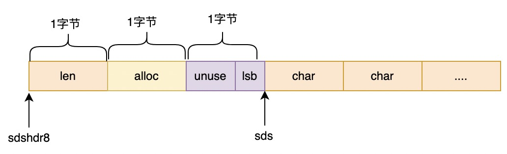
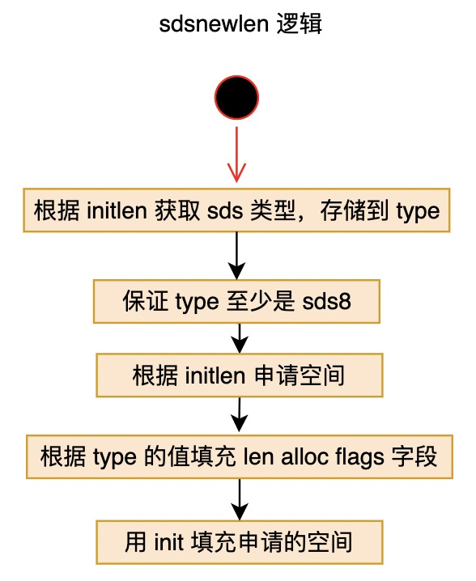
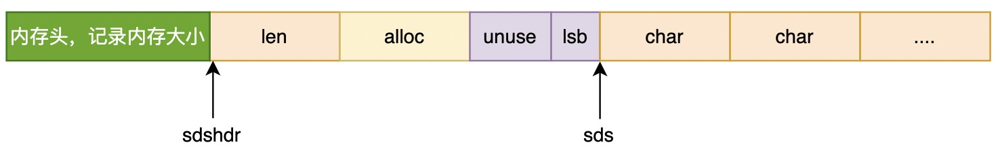
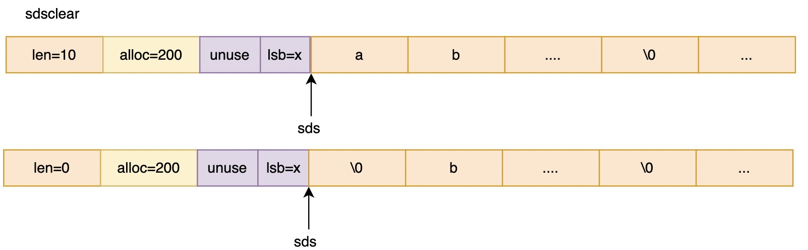
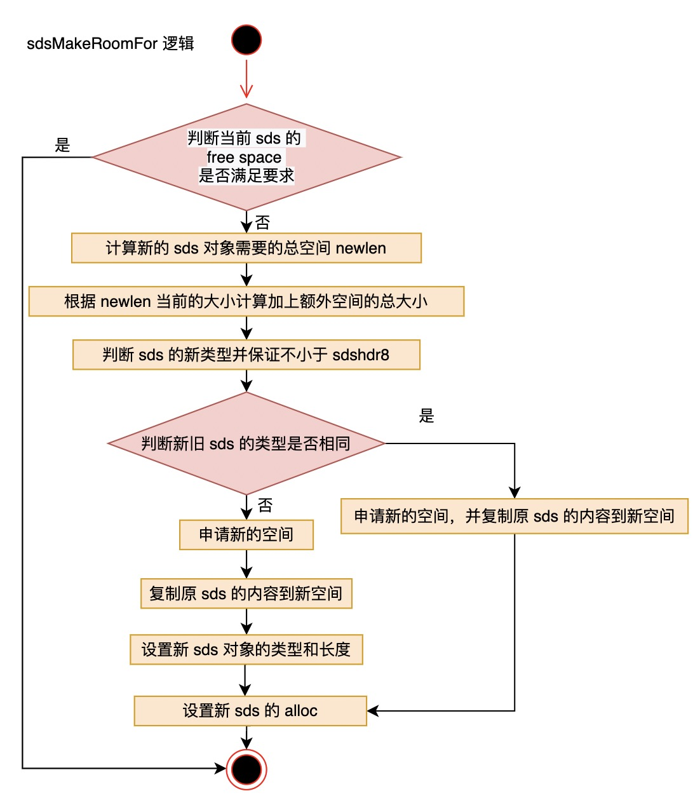

注：sds 部分根据 redis 源码中 6.0.0 进行解析，commit id 为 17dfd7cab.

# redis 字符串类型

字符串在 redis 中属于最重要的类型之一，使用频率极高。而 redis 的字符串类型，内部实现分为三种：

- 有符号 int，redis 对外没有整数的类型，而是表现为字符串；如果一个字符串可以用整数表示，则会直接用整数存储这个字符串；
- raw；
- embstr，简单动态字符串；

后面两种类型，它们只有微小的不同，底层都使用了 redis 中的 sds 类型。


# c 语言 char * 的问题

c 语言中，没有单独的字符串类型，而是用 char* 来表示一个字符串，这个字符串要求必须用 \0 结尾；且字符串没有任何自己的属性，只是一段连续内存空间；这就导致它有几个问题：

- 迭代字符串时容易越界，因为字符串并不知道自己有多长，迭代时，直到遇到 \0 为止，如果没有遇到这个符号，就会一直遍历下去，容易发生越界，但程序可能并没有意识到；
- c 中很多接受 char * 作为参数的函数，为了避免上面的问题，往往会再额外传一个长度参数给该函数，这样一方面会导致函数声明变长，另一方面也要求这个参数的值要合理才行；
- 上面提到的字符串长度，为了获取这个长度，c 中提供了 strlen 函数，不过这个函数内部其实就是从 char* 开头开始一直遍历，直到遇到 \0 ，这是一个 o(n) 操作，如果用户不小心对一个 char* 频繁调用该函数，可能会非常低效；
- 用 char* 保存二进制内容不方便，因为二进制内容大概率不会以  \0 结尾；
- 对字符串进行追加、删除操作等不方便，c 原生字符串是只读的，要想修改需要重新申请内存；


# sds 类型

为了解决上面提到的问题， redis 引入了 sds 类型，这个类型有如下特点：

- 字符串的长度由单独属性记录，查询字符串长度可以在 o(1) 时间内完成；
- 字符串有冗余空间，当对字符串进行追加时，可以一定程度上避免重新申请内存；当然这也导致 sds 占用内存可能会大，不过 redis 有缩容机制；
- 提供接口用来原地修改字符串某个字节；
- 可以存储二进制数据；
- 兼容 c 中的 char*，sds 的最后一个字节都是 \0；
- 虽然叫做 sds，本质上其实就是 char *；
- 长度、冗余等信息都存储在 sds 的头信息中，而这个头部不属于 sds；redis 为了优化 sds 的性能，提供了 5 种不同的结构体实现 sds；


## sds 的五种头

### 结构体声明

```c
// sds.h
typedef char *sds;

/* Note: sdshdr5 is never used, we just access the flags byte directly.
 * However is here to document the layout of type 5 SDS strings. */
struct __attribute__ ((__packed__)) sdshdr5 {
    unsigned char flags; /* 3 lsb of type, and 5 msb of string length */
    char buf[];
};
struct __attribute__ ((__packed__)) sdshdr8 {
    uint8_t len; /* used */
    uint8_t alloc; /* excluding the header and null terminator */
    unsigned char flags; /* 3 lsb of type, 5 unused bits */
    char buf[];
};
struct __attribute__ ((__packed__)) sdshdr16 {
    uint16_t len; /* used */
    uint16_t alloc; /* excluding the header and null terminator */
    unsigned char flags; /* 3 lsb of type, 5 unused bits */
    char buf[];
};
struct __attribute__ ((__packed__)) sdshdr32 {
    uint32_t len; /* used */
    uint32_t alloc; /* excluding the header and null terminator */
    unsigned char flags; /* 3 lsb of type, 5 unused bits */
    char buf[];
};
struct __attribute__ ((__packed__)) sdshdr64 {
    uint64_t len; /* used */
    uint64_t alloc; /* excluding the header and null terminator */
    unsigned char flags; /* 3 lsb of type, 5 unused bits */
    char buf[];
};
```

首先，所谓 sds 就是 char * ；很多 c 中针对 char* 的函数，也可接收 sds 作为参数；

其次， sds 共声明了五种头结构体，不同的头其字符串部分长度不同，sds5 的使用比较特殊，另外四种用法一致；

第三，要注意的是，每个结构体中都声明了 \__attribute__ ((\__packed__))，即表示相应的结构体在内存中不会做内存对齐，而是紧凑内存，这是为了方便根据 sds 的位置能迅速确定出整个结构体的起始位置。

### sds 头结构

除了 sds5 之外的其它四种，它们都使用了类似下面的结构：


1. len 表示 sds 结构中已经被使用的字节数，也就是字符串的长度；


2. alloc 表示 sds 结构中分配的总字节数，是已有内容和冗余空间的总和；

3. flags 是一个单字节的字段，使用的只有最低的 3 位，用来表示 sds 头是上面四种中的哪一种；

可以看到，这四种的整体结构是很像的，区别只是 len alloc 的取值范围不同，意即它们能容纳的 sds 字节数不同。

### sds5 

sds5 不太一样，它没有 len 和 alloc 部分，它的 flags 字段中，高位的 5 位会用来标记字符串部分的字节数，也就是说 sds5 种字符串长度不会超过 63；但这个长度是在太短，与 embstr 有一定冲突；而且 sdshdr5 没有 len 和 alloc 字段，它没有任何冗余空间，完全就是一个原生 c 版字符串，所以 redis 中其实不会用这个类型；


## sds 宏定义

除了使用宏定义不同的类型外，目前看到的 sds 中比较重要的宏定义包括以下三个：

```c
// sds.h
#define SDS_HDR_VAR(T,s) struct sdshdr##T *sh = (void*)((s)-(sizeof(struct sdshdr##T)));
```

SDS_HDR_VAR ，根据给定的 sds 结构体，查找对应结构体正确的起始地址，并构建出一个有固定名称的 sh 变量；

其中 s 是 sds 的指针起始位置；sdshdr##T 是 c 中的语法，T 的取值包括 8 16 32 64；以 T=8 为例：



当 T=8时，上面就变成：

```c
// sds.h
#define SDS_HDR_VAR(T,s) struct sdshdr8 *sh = (void*)((s)-(sizeof(struct sdshdr8)));
```

由于结构体都被声明为紧凑型的，就使得 sds-1 正好是 flags 字段，根据其中的 lsb 能迅速确定整个 sds 的类型，假如是 sdshdr8，那么 sds-1-1 就是 alloc 字段， sds-1-2 则是 len 字段，而 len 字段也正好是 sdshdr8 的起始地址。其它三种同理。


```c
// sds.h
#define SDS_HDR(T,s) ((struct sdshdr##T *)((s)-(sizeof(struct sdshdr##T))))
```

类似上面，获取一个 sds 真实的起始指针；

sds 中有几个内联函数，对 sds 的头进行操作，如获取长度的 sdslen、获取可用空间的 sdsavail、设置长度的 sdssetlen 等，这些函数内部都是通过 SDS_HDR 先获取到 sds 的起始地址后，再获取 len 或者 alloc 字段实现功能；


```c
// sds.h
#define SDS_TYPE_5_LEN(f) ((f)>>SDS_TYPE_BITS)
```

获取 sds5 的字符串字节数，因为 sdshdr5 这种类型，它存储的字符串长度在 flags 的高 5 位中，因此通过解析 flags 就可以知道它存储的字符串长度。


## sds 函数

### sdsnewlen

#### 函数原型

```c
// sds.c
sds sdsnewlen(const void *init, size_t initlen) {
    void *sh;
    sds s;
    char type = sdsReqType(initlen);
    /* Empty strings are usually created in order to append. Use type 8
     * since type 5 is not good at this. */
    if (type == SDS_TYPE_5 && initlen == 0) type = SDS_TYPE_8; // sds5 会被强制使用 sds8
    int hdrlen = sdsHdrSize(type);
    unsigned char *fp; /* flags pointer. */

    sh = s_malloc(hdrlen+initlen+1); // +1 是因为尾部会追加 \0
    if (sh == NULL) return NULL;
    if (init==SDS_NOINIT)
        init = NULL;
    else if (!init)
        memset(sh, 0, hdrlen+initlen+1);
    s = (char*)sh+hdrlen; // 这里得到新生成的 sds 的起始位置
    fp = ((unsigned char*)s)-1; // sds 往左一个字节就是 flags 的地址
    switch(type) {
        case SDS_TYPE_5: {
            *fp = type | (initlen << SDS_TYPE_BITS);
            break;
        }
        case SDS_TYPE_8: {
            SDS_HDR_VAR(8,s);
            sh->len = initlen;
            sh->alloc = initlen;
            *fp = type;
            break;
        }
        case SDS_TYPE_16: {
            SDS_HDR_VAR(16,s);
            sh->len = initlen;
            sh->alloc = initlen;
            *fp = type;
            break;
        }
        case SDS_TYPE_32: {
            SDS_HDR_VAR(32,s);
            sh->len = initlen;
            sh->alloc = initlen;
            *fp = type;
            break;
        }
        case SDS_TYPE_64: {
            SDS_HDR_VAR(64,s);
            sh->len = initlen;
            sh->alloc = initlen;
            *fp = type;
            break;
        }
    }
    if (initlen && init)
        memcpy(s, init, initlen); // 将 init 指向的字符串复制到 sds 中
    s[initlen] = '\0'; // 在 sds 最后填充 \0
    return s;
}
```

#### 函数功能

这个函数根据传入的 init 指针和给定的 initlen 长度，构建一个新的 sds 结构体, 其中 init 是一个 char *， initlen 给出这个字符串的长度；

这个函数会被 sds 中多个函数调用：

- 用空字符串生成一个新的 sds 结构 (sdsempty 函数)；
- 用非空字符串生成一个新的 sds 结构 (sdsnew函数)；
- 用既有 sds 复制一个内容完全一样的新的 sds 结构 (sdsdup函数)；


#### 函数逻辑



需要注意的地方有两个：

- 尽量不使用 sds5，作者认为，如果 initlen 为 0，那么这个 sds 往往是用来进行追加的，而 sds5 没有额外空间，因此 sds5 都会被重置为 sds8；
- 当字符串部分用 init 初始化完毕后，会在末尾追加一个 '\0'，与 c 的字符串兼容；


### sdsfree

#### 函数原型

```c
// sds.c
void sdsfree(sds s) {
    if (s == NULL) return;
    s_free((char*)s-sdsHdrSize(s[-1]));
}
```

#### 函数功能

根据给定的 sds，释放整个结构体内存；注意的是，它接受的是 sds 的指针位置，而不是 sdshdr 的指针位置；根据 sds 的信息，找到 sdshdr 的位置，最终调用系统的 free 函数完成内存释放。



### sdsclear

#### 函数原型

```c
// sds.c
void sdsclear(sds s) {
    sdssetlen(s, 0);
    s[0] = '\0';
}
```

#### 函数功能

将 sds 的 len 设置为 0，然后将 sds[0] 设置为 '\0', 其它空间不受影响，其它任何属性也都不变；当 append 时，避免再次申请空间；

这个函数内部调用 sdssetlen 函数，这个函数回根据 flags 的值，确定 len 的位置；




### sdsMakeRoomFor

#### 函数原型

```c
// sds.c
sds sdsMakeRoomFor(sds s, size_t addlen) {
    void *sh, *newsh;
    size_t avail = sdsavail(s);
    size_t len, newlen;
    char type, oldtype = s[-1] & SDS_TYPE_MASK;
    int hdrlen;

    /* Return ASAP if there is enough space left. */
    if (avail >= addlen) return s;

    len = sdslen(s);
    sh = (char*)s-sdsHdrSize(oldtype);
    newlen = (len+addlen);
    if (newlen < SDS_MAX_PREALLOC)
        newlen *= 2;
    else
        newlen += SDS_MAX_PREALLOC;

    type = sdsReqType(newlen);

    /* Don't use type 5: the user is appending to the string and type 5 is
     * not able to remember empty space, so sdsMakeRoomFor() must be called
     * at every appending operation. */
    if (type == SDS_TYPE_5) type = SDS_TYPE_8;

    hdrlen = sdsHdrSize(type);
    if (oldtype==type) {
        newsh = s_realloc(sh, hdrlen+newlen+1);
        if (newsh == NULL) return NULL;
        s = (char*)newsh+hdrlen;
    } else {
        /* Since the header size changes, need to move the string forward,
         * and can't use realloc */
        newsh = s_malloc(hdrlen+newlen+1);
        if (newsh == NULL) return NULL;
        memcpy((char*)newsh+hdrlen, s, len+1);
        s_free(sh);
        s = (char*)newsh+hdrlen;
        s[-1] = type;
        sdssetlen(s, len);
    }
    sdssetalloc(s, newlen);
    return s;
}
```

#### 函数功能

当需要向一个既有的 sds 结构体追加文本时，需要先使用该函数，它被调用成功后，会保证新的 sds 中有至少 addlen 个自由空间字节来容纳新串。

需要注意三点：

- 如果结构中自由空间大小大于 addlen，则不会执行扩容，而是直接返回原来的 s；
- 如果执行了扩容，会返回全新的内存区域，原来的 s 指向的空间会被释放；
- 扩容时，不仅仅是保证新空间有至少 addlen 个自由空间，如果新的 len 不超过 1 M, 会 len 翻倍后才扩容，而超过的话，会保证 len 后还有 1 M 的自由空间；




### sdsRemoveFreeSpace

#### 函数原型

```c
// sds.c
sds sdsRemoveFreeSpace(sds s) {
    void *sh, *newsh;
    char type, oldtype = s[-1] & SDS_TYPE_MASK;
    int hdrlen, oldhdrlen = sdsHdrSize(oldtype);
    size_t len = sdslen(s);
    size_t avail = sdsavail(s);
    sh = (char*)s-oldhdrlen;

    /* Return ASAP if there is no space left. */
    if (avail == 0) return s;

    /* Check what would be the minimum SDS header that is just good enough to
     * fit this string. */
    type = sdsReqType(len);
    hdrlen = sdsHdrSize(type);

    /* If the type is the same, or at least a large enough type is still
     * required, we just realloc(), letting the allocator to do the copy
     * only if really needed. Otherwise if the change is huge, we manually
     * reallocate the string to use the different header type. */
    if (oldtype==type || type > SDS_TYPE_8) {
        newsh = s_realloc(sh, oldhdrlen+len+1);
        if (newsh == NULL) return NULL;
        s = (char*)newsh+oldhdrlen;
    } else {
        newsh = s_malloc(hdrlen+len+1);
        if (newsh == NULL) return NULL;
        memcpy((char*)newsh+hdrlen, s, len+1);
        s_free(sh);
        s = (char*)newsh+hdrlen;
        s[-1] = type;
        sdssetlen(s, len);
    }
    sdssetalloc(s, len);
    return s;
}
```

#### 函数功能

该函数会移除 sds 末尾所有的自由空间，释放原结构体并返回新的结构体；这个操作结束后，整个新的 sds 将没有任何待分配空间，这就导致如果下次需要 append，一定会发生 realloc。


### sdscat

#### 函数原型

```c
// sds.c
sds sdscatlen(sds s, const void *t, size_t len) {
    size_t curlen = sdslen(s);

    s = sdsMakeRoomFor(s,len); // 保证 sds 对象有足够的空间容纳。
    if (s == NULL) return NULL;
    memcpy(s+curlen, t, len);
    sdssetlen(s, curlen+len);
    s[curlen+len] = '\0';
    return s;
}
```

#### 功能

这个函数用来将一个 c 字符串追加到一个既有 sds 对象中，可以看到，在追加之前，先调用 sdsMakeRoomFor 函数进行了扩容。

### sdscatsds

将一个 c 字符串追加到一个 sds 中。

#### 函数原型

```c
// sds.c
sds sdscatsds(sds s, const sds t) {
    return sdscatlen(s, t, sdslen(t));
}
```

#### 功能

同上，不过是将一个 sds 中的字符串部分追加到一个 sds 中，


### sdsfromlonglong

#### 函数原型

```c
// sds.c
sds sdsfromlonglong(long long value) {
    char buf[SDS_LLSTR_SIZE];
    int len = sdsll2str(buf,value);

    return sdsnewlen(buf,len);
}
```

#### 函数功能

将一个 long long 转为 sds 结构体。


### sdsrange

#### 函数原型

```c
// sds.c
void sdsrange(sds s, ssize_t start, ssize_t end) {
    size_t newlen, len = sdslen(s);

    if (len == 0) return;
    if (start < 0) {
        start = len+start;
        if (start < 0) start = 0;
    }
    if (end < 0) {
        end = len+end;
        if (end < 0) end = 0;
    }
    newlen = (start > end) ? 0 : (end-start)+1;
    if (newlen != 0) {
        if (start >= (ssize_t)len) {
            newlen = 0;
        } else if (end >= (ssize_t)len) {
            end = len-1;
            newlen = (start > end) ? 0 : (end-start)+1;
        }
    } else {
        start = 0;
    }
    if (start && newlen) memmove(s, s+start, newlen);
    s[newlen] = 0;
    sdssetlen(s,newlen);
}
```

#### 函数功能

截取 sds 中指定范围的字节，用这段中的内容重置 sds；它支持负索引，并且是双闭区间。它不会释放 sds 的空间，而是在原地移动替换，在替换结束后，更新 len 属性即可，即 alloc 属性不会变。

如果想快速清理 sds，但不想重新分配空间，只要执行 sdsrange(s, 1, 0) 即可。


### sdscmp

#### 函数原型

```c
// sds.c
int sdscmp(const sds s1, const sds s2) {
    size_t l1, l2, minlen;
    int cmp;

    l1 = sdslen(s1);
    l2 = sdslen(s2);
    minlen = (l1 < l2) ? l1 : l2;
    cmp = memcmp(s1,s2,minlen);
    if (cmp == 0) return l1>l2? 1: (l1<l2? -1: 0);
    return cmp;
}
```

#### 函数功能

用来对两个 sds 进行比较，遵循的规则与 c 的 cmp 一样, 都是先获取到两个对象的 len，在 len 范围内，比较两个是否一样，len 相同的情况下，谁更长则谁更大。


### sdssplitlen

#### 函数原型

```c
// sds.c
sds *sdssplitlen(const char *s, ssize_t len, const char *sep, int seplen, int *count) {
    int elements = 0, slots = 5;
    long start = 0, j;
    sds *tokens;

    if (seplen < 1 || len < 0) return NULL;

    tokens = s_malloc(sizeof(sds)*slots);
    if (tokens == NULL) return NULL;

    if (len == 0) {
        *count = 0;
        return tokens;
    }
    for (j = 0; j < (len-(seplen-1)); j++) {
        /* make sure there is room for the next element and the final one */
        if (slots < elements+2) {
            sds *newtokens;

            slots *= 2;
            newtokens = s_realloc(tokens,sizeof(sds)*slots);
            if (newtokens == NULL) goto cleanup;
            tokens = newtokens;
        }
        /* search the separator */
        if ((seplen == 1 && *(s+j) == sep[0]) || (memcmp(s+j,sep,seplen) == 0)) {
            tokens[elements] = sdsnewlen(s+start,j-start);
            if (tokens[elements] == NULL) goto cleanup;
            elements++;
            start = j+seplen;
            j = j+seplen-1; /* skip the separator */
        }
    }
    /* Add the final element. We are sure there is room in the tokens array. */
    tokens[elements] = sdsnewlen(s+start,len-start);
    if (tokens[elements] == NULL) goto cleanup;
    elements++;
    *count = elements;
    return tokens;

cleanup:
    {
        int i;
        for (i = 0; i < elements; i++) sdsfree(tokens[i]);
        s_free(tokens);
        *count = 0;
        return NULL;
    }
}
```

#### 函数功能

类似于字符串分割，将一个给定的字符串按照给定的分隔符进行切分，每个分割出来的都作为一个新的 sds，加入到一个 sds 数组中。

其中，count 指针存储返回的 sds 数组长度，用 tokens 表示返回的 sds *数组；为了避免频繁申请内存，代码中 tokens 的长度要比返回的 tokens 长一些，而且返回之前没有做消除处理。