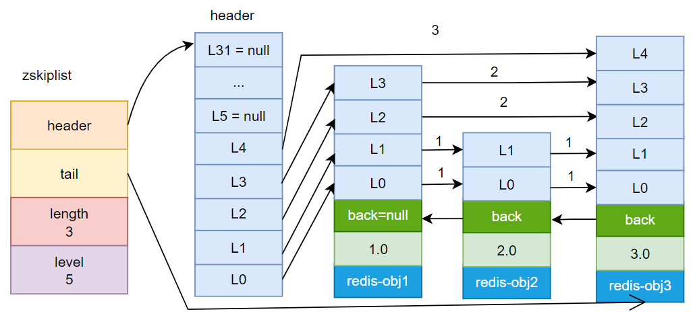
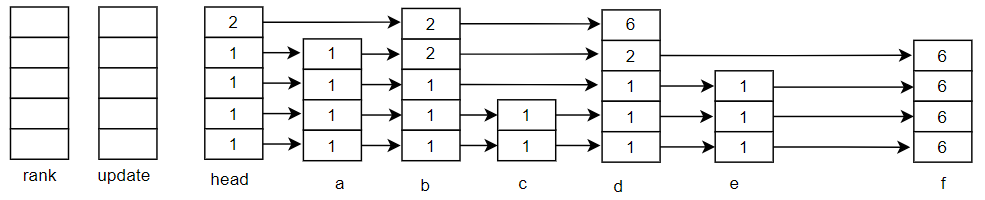
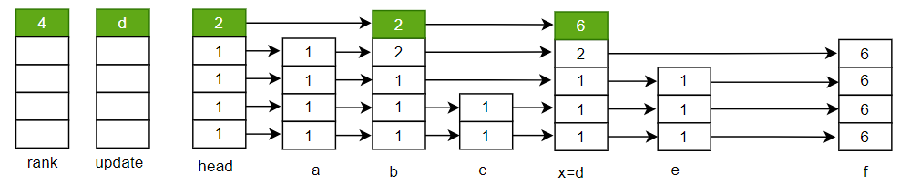
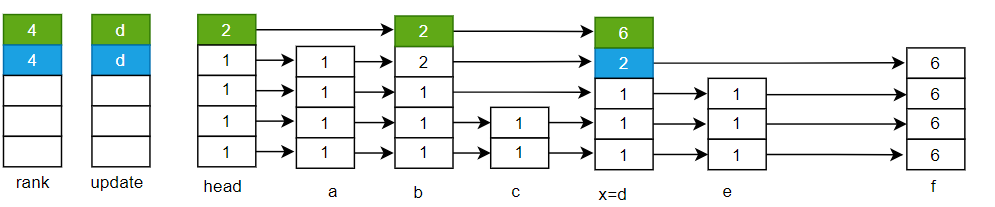
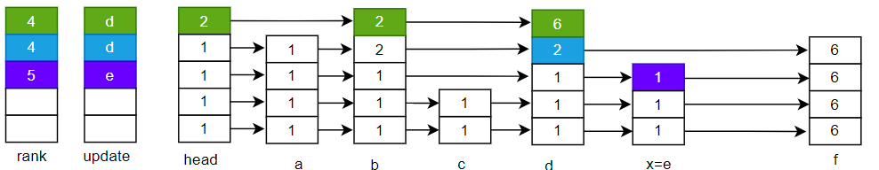
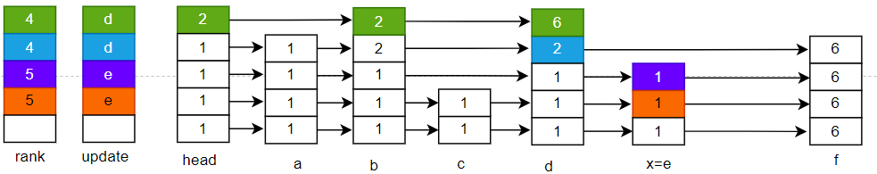
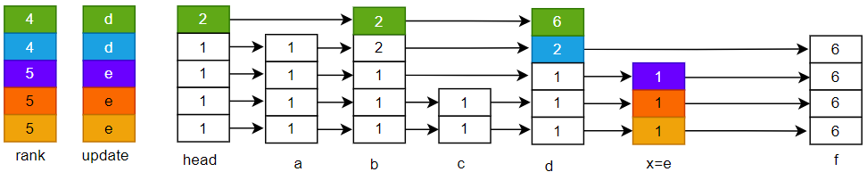
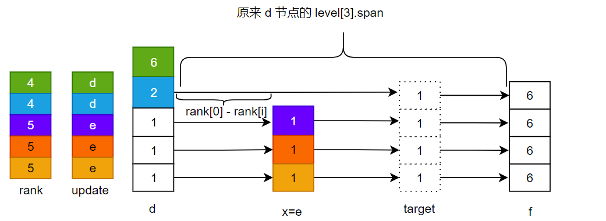

## 跳表

跳表是一种类似于红黑树的结构，只用在有序集合中，它由多个节点组成，每个节点都存储了节点的分值，以保证有序性；同时每个节点又通过一个指针指向对应的 redis-object 对象。查找节点时，它不需要对所有节点进行查找，而是一层层寻找，每层都比底下一层节点更少，这样可以更快找到目标节点，接近 log(n)的查询速率。

有序集合有两种底层实现，其中一种就是跳表；但是跳表跟红黑树类似，导致其并不能保证所有操作的时间性能，因此当使用跳表实现有序集合时，要跟哈希一起使用。

#### 数据结构定义

```c
// redis.h
typedef struct zskiplistNode {
    robj *obj;
    double score;
    struct zskiplistNode *backward; 
    struct zskiplistLevel {
        struct zskiplistNode *forward;
        unsigned int span;
    } level[];
} zskiplistNode;

typedef struct zskiplist {
    struct zskiplistNode *header, *tail;
    unsigned long length;
    int level;
} zskiplist;
```


#### node 参数说明

- obj，跳表通过指针指向 redis-object，使用指针可以共享内存，节省空间；
- score，每个节点的分值，节点按照分值递增排序；
- backward，跳表为了实现逆序遍历，每个节点都会通过指针指向前置节点；
- level，这是一个数组，数组长度是在节点生成时随机生成的，同一层的节点通过 forward 指针连起来形成一个单向链表；而 span 表示同层的这两个节点之间距离几个节点；


#### zskiplist 参数说明

- header，header 是个 zskiplistNode 结构，但它不存储有效的 obj 信息，只是为了存储每一层链表的头指针；它的 level 高度是固定的，编译时默认是 32 层高；

  ```c
  #define ZSKIPLIST_MAXLEVEL 32
  ```

- tail，这个指针指向整个跳表的最后一个节点，方便逆序遍历；

- length，表示跳表中所有的节点数；

- level，表示跳表中所有节点的最高层；


整个跳表的结构如下图：



#### 跳表的初始化

```c
// t_zset.c
zskiplist *zslCreate()
```

创建并初始化一个跳表结构体，设置跳表的层高、长度、尾结点等信息，并对 header 进行初始化，header 的每一层节点的 foraward 都被置位 null。


#### 插入节点

```c
// t_zset.c
zskiplistNode *zslInsert(zskiplist *zsl, double score, robj *obj) {
    zskiplistNode *update[ZSKIPLIST_MAXLEVEL], *x;
    unsigned int rank[ZSKIPLIST_MAXLEVEL];
    int i, level;

    redisAssert(!isnan(score));
    x = zsl->header;
    // 这个循环负责找到节点被插入的位置上，其各层对应链表的前节点，因为除了最底层外，其它各层都是单向链表。
    for (i = zsl->level-1; i >= 0; i--) {
        /* store rank that is crossed to reach the insert position */
        rank[i] = i == (zsl->level-1) ? 0 : rank[i+1];
        while (x->level[i].forward &&
            (x->level[i].forward->score < score ||
                (x->level[i].forward->score == score &&
                compareStringObjects(x->level[i].forward->obj,obj) < 0))) {
            rank[i] += x->level[i].span; // todo gzx 将总的步长累加了起来
            x = x->level[i].forward;
        }
        update[i] = x; // 记录下了每层能到达的最远的节点
    }
    /* we assume the key is not already inside, since we allow duplicated
     * scores, and the re-insertion of score and redis object should never
     * happen since the caller of zslInsert() should test in the hash 8table
     * if the element is already inside or not. */
    // 这里的操作负责生成节点，设置该节点各层链表的下一个指针，调整前置各节点的信息；
    level = zslRandomLevel();
    if (level > zsl->level) {
        for (i = zsl->level; i < level; i++) {
            rank[i] = 0;
            update[i] = zsl->header;
            update[i]->level[i].span = zsl->length; 
        }
        zsl->level = level;
    }
    x = zslCreateNode(level,score,obj);
    for (i = 0; i < level; i++) {
        x->level[i].forward = update[i]->level[i].forward;
        update[i]->level[i].forward = x;

        /* update span covered by update[i] as x is inserted here */
        x->level[i].span = update[i]->level[i].span - (rank[0] - rank[i]);
        update[i]->level[i].span = (rank[0] - rank[i]) + 1;
    }

    /* increment span for untouched levels */
    // 这里负责调整跨度
    for (i = level; i < zsl->level; i++) {
        update[i]->level[i].span++;
    }
	
    // 设置目标节点的前置节点
    x->backward = (update[0] == zsl->header) ? NULL : update[0];
    if (x->level[0].forward)
        x->level[0].forward->backward = x;
    else
        zsl->tail = x;
    zsl->length++;
    return x;
}
```

这是一个内部函数，它不保证不会插入重复节点，要求调用方在调用它时，先去有序集合对应的哈希表中查询相应的节点是否已经存在。

它操作的逻辑如下：

1. 对跳表从最高层到最低层，层层遍历，找到节点被插入位置处，其对应各层的前置节点；各层前置节点会存储在 update 中，而 rank 则存储了各层到目标位置处各自总的节点数；
2. 生成一个随机高度用来给新节点设置层高，如果这个高度已经超过了当前跳表的层高，则要对跳表层高进行调整，同时 update 中那些超过之前高度的位置前置节点都要置为 head，跨度则设置为跳表长度；
3. 生成新的跳表节点，并设置该节点对应各层的后置节点和调整前置节点对应的后置节点；此外需要设置新节点各层的跨度和调整前置节点的跨度；
4. 如果节点是新的tail节点，则要调整跳表的 tail；否则调整节点后置节点的前置指针；

##### 插入节点过程

###### 插入前结构

插入前跳表结构如下，整个跳表有 6 个节点，跳表层高为 5；每个 level 中的数字表示 span；假设节点的插入位置为 e 和 f 之间。



###### 遍历第 5 层

按照源码的设计，要从最高层第 5 层开始遍历；第五层链表头结点存储在 head 的 level[4] 中，这个节点的 forward 指向 b 节点，通过比较，发现 b 节点的分值小于要插入节点的分值，于是我们继续从 b 的 level[4] 中获取到下一个节点即 d 节点，这样 a 节点就被跳过不需要查看了，另外我们累加步长 2 ，可以看到 b 正好在整个跳表中递增排第 2；对 d 节点进行判断，发现它依然比要插入的节点小，所以继续寻找 d 的 level[4] 的 forward 节点，但是这个 forward 为空，所以第 5 层的遍历结束，另外就是累计步长 2 得到 4，d 正好排第 4；整个过程中我们跳过了 a 和 c 节点，最终状态如下，其中 x 指向了 d 节点：



###### 遍历第 4 层 

开始遍历第四层时，从 第五层终止的位置开始，即 x=d 节点，前面已经遍历或者跳过的节点不需要再遍历，基本过程类似于上面。

首先获取 d 的 level[3] 的 forward 节点，但是这个节点是空，所以第四层遍历结束，同时更新 rank，由于压根没有往其它节点移动，因此总步长不变，最终结果如下，我们看到，x 依然指向 d 节点：



###### 遍历第 3 层

开始遍历第三层，同样是从第四层结束的地方开始，即从 x=d 开始，获取 d 的level[2] 的 forward 节点，即获取到 e，通过对比，发现 e 比待插入值小，因此 x 节点往前移动，即 x 指向 e，同时累加步长到 5,；再获取 e 的 level[2] 的 forward 节点，即获取到 f，但是比较发现 f 大，因此第三层的遍历结束，最终结果如下：



###### 遍历第 2 层

开始遍历第 2 层，从 x=e 节点开始，e 的 level[1] 的 forward 指向 f，这一层遍历又停止了，最终状态如下：



###### 遍历第 1 层

开始遍历第 1 层，从 x = e 节点开始，e 的 level[0]的 forward 指向 f， 这一层遍历停止，最终状态如下：



由于第 1 层已经是最底层，因此对跳表的整个遍历就结束了，我们最终可以确定，要插入的位置就在 e 节点和 f 节点之间。

###### 生成新节点

生成新节点时，主要是给该节点生成一个随机的 level 高度；skip 内部有一个随机整数生成器，它会保证生成的高度在指定范围内，且高度越高，则生成的概率越小。

```c
...
level = zslRandomLevel();
if (level > zsl->level) {
    for (i = zsl->level; i < level; i++) {
        rank[i] = 0;
        update[i] = zsl->header;
        update[i]->level[i].span = zsl->length; 
    }
    zsl->level = level;
}
...
```

看上面的代码，在生成这个节点对应的层数后，主要是要处理一下当这个节点的高度超过了跳表的高度时，需要先将 update 中额外高度前置节点置位跳表的 head，方便后续统一的操作；而这些层高的跨度也被置位为跳表当前的长度；更新跳表新高度；


###### 设置插入节点的属性

这一步是对新节点各层从低到高进行遍历，设置该节点每层的 forward 信息，并更新 update 中对应节点的 forward 指向新生成的节点；

这里最复杂的是如何更新当前节点和 update 中各节点的 span 信息；源码中的代码如下：

```c
 x->level[i].span = update[i]->level[i].span - (rank[0] - rank[i]);
 update[i]->level[i].span = (rank[0] - rank[i]) + 1;
```

首先 rank 中存储的各层节点的排名，其中 rank[0] 存储的是新节点的 backward 节点的排名。

rank[0] - rank[i] 得到的是 update[i] 节点到插入节点的 backward 的步长；

update[i]->level[i].span - (rank[0] - rank[i]) 其实就是 update[i] 的步长减去上面的步长，就是新节点对应层的步长。

以上面示例中的过程为例，现在计算新节点第 4 层的步长；update[3] 为 d 节点，它的步长是 2，而对应的 rank[3] 为 4，rank[0] 为 5；

rank[0] - rank[3] 可以计算出 d 到 新节点的前置节点 e 步长是 1；而 update[3]->level[3].span - (rank[0] - rank[3]) d=1 正好就是新节点对应层高的步长。



其实上面的 update[i]->level[i].span - (rank[0] - rank[i])，更容易理解的写法是 update[i]->level[i].span + 1 - (rank[0] - rank[i]) - 1，因为在 e 和 f 之间新增了一个节点，所以总步长应该加 1，但是这个多出来的节点导致 e 与该新节点有一个步长 1，因此又要减去 1，两者相抵正好就是上面的写法。

###### 设置新节点额外高度的步长

跳表中那些没有 forward 的层高，步长都是当前跳表的长度，而上面生成新节点的操作中，这些额外层高的步长是老的总长度，因此这里都做了 +1 操作；

###### 收尾操作

所谓收尾，第一是要看新节点是否要设置前置节点；如果它是头一个节点，就不需要，否则要设置它的前置节点；第二是查看新节点是否有 forward，如果有则需要将该节点的 backward 指向新节点，上图中即将 f 的 backward 指向 target；如果没有，说明该新节点是个新的尾结点，要更新跳表的 tail 指针；最后更新跳表总长度并返回。


#### 删除节点

删除节点与插入节点类似，它的源码见：

```c
// t_zset.c
void zslDeleteNode(zskiplist *zsl, zskiplistNode *x, zskiplistNode **update)
{
    int i;
    // 以下部分将待删除节点各层对应前面节点置位
    for (i = 0; i < zsl->level; i++)
    {
        if (update[i]->level[i].forward == x)
        {
            update[i]->level[i].span += x->level[i].span - 1;
            update[i]->level[i].forward = x->level[i].forward; // 这里保证了如果节点是最后一个节点，会给其前置节点置空
        }
        else
        {
            update[i]->level[i].span -= 1;
        }
    }
    /*
     这一部分修改最底层节点的信息，待删除节点是末尾节点时，需要将跳表的 tail 指向倒数第二个节点;如果不是，则需要修改待删除节点最底层上后置节点的前置节点信息;
     之所只修改后置节点的前置节点信息，是因为前置节点的后置节点信息已经在上面的循环中被处理;
     */
    if (x->level[0].forward)
    {
        x->level[0].forward->backward = x->backward;
    }
    else
    {
        zsl->tail = x->backward;
    }
    // 修改跳表的总长度和层高
    while (zsl->level > 1 && zsl->header->level[zsl->level - 1].forward == NULL)
        zsl->level--;
    zsl->length--;
}

/* Delete an element with matching score/object from the skiplist. */
int zslDelete(zskiplist *zsl, double score, robj *obj)
{
    zskiplistNode *update[ZSKIPLIST_MAXLEVEL], *x; // 存储要删除的节点每一层的前一个节点
    int i;

    x = zsl->header;
    for (i = zsl->level - 1; i >= 0; i--)
    {
        while (x->level[i].forward &&
               (x->level[i].forward->score < score ||
                (x->level[i].forward->score == score &&
                 compareStringObjects(x->level[i].forward->obj, obj) < 0)))
            x = x->level[i].forward;
        update[i] = x;
    }
    /* We may have multiple elements with the same score, what we need
     * is to find the element with both the right score and object. */
    x = x->level[0].forward;
    if (x && score == x->score && equalStringObjects(x->obj, obj))
    {
        zslDeleteNode(zsl, x, update);
        zslFreeNode(x);
        return 1;
    }
    return 0; /* not found */
}
```

整体逻辑相对插入来说就简单多了，主要逻辑如下：

1. 用类似于插入中的逻辑，找到待删除节点各层对应的前置链表节点，所有这些节点同样存储在意定长数组中；
2. 根据待删除节点和各层前置节点是否有前置关系，修改各层节点的跨度和后置节点信息；
3. 重置待删除节点 forward 的 backward 或者调整跳表的 tail；
4. 调整跳表层高和长度；


#### 删除指定分值范围的所有节点

函数源码如下：

```c
// t_zset.c
unsigned long zslDeleteRangeByScore(zskiplist *zsl, zrangespec *range, dict *dict)
{
    zskiplistNode *update[ZSKIPLIST_MAXLEVEL], *x;
    unsigned long removed = 0;
    int i;

    x = zsl->header;
    // 这一段找到最小的节点
    for (i = zsl->level - 1; i >= 0; i--)
    {
        while (x->level[i].forward && (range->minex ? x->level[i].forward->score <= range->min : x->level[i].forward->score < range->min))
            x = x->level[i].forward;
        update[i] = x;
    }

    /* Current node is the last with score < or <= min. */
    x = x->level[0].forward;

    /* Delete nodes while in range. */
    while (x &&
           (range->maxex ? x->score < range->max : x->score <= range->max))
    {
        zskiplistNode *next = x->level[0].forward;
        zslDeleteNode(zsl, x, update);
        dictDelete(dict, x->obj);
        zslFreeNode(x);
        removed++;
        x = next;
    }
    return removed;
}
```

这个函数会根据 range 指定的分值范围，删除分值在这个范围内的所有节点；另外，由于基于跳表的有序集合要配合哈希使用，因此在跳表中删除这些节点的同时，也会删除哈希表中对应的键值对。

可以看到它会先找到满足要求的第一个节点，因为所有满足要求的节点必然是连续的，因此找到后，通过该节点最底层的 forward 即可以一个个找到这些点并删除。

函数最后会返回删除的节点数。


#### 根据排名删除节点

函数原型如下：

```c
//t_zset.c
/* Delete all the elements with rank between start and end from the skiplist.
 * Start and end are inclusive. Note that start and end need to be 1-based */
unsigned long zslDeleteRangeByRank(zskiplist *zsl, unsigned int start, unsigned int end, dict *dict)
{
    zskiplistNode *update[ZSKIPLIST_MAXLEVEL], *x;
    unsigned long traversed = 0, removed = 0;
    int i;

    x = zsl->header;
    for (i = zsl->level - 1; i >= 0; i--)
    {
        while (x->level[i].forward && (traversed + x->level[i].span) < start)
        {
            traversed += x->level[i].span;
            x = x->level[i].forward;
        }
        update[i] = x;
    }

    traversed++;
    x = x->level[0].forward;
    while (x && traversed <= end)
    {
        zskiplistNode *next = x->level[0].forward;
        zslDeleteNode(zsl, x, update);
        dictDelete(dict, x->obj);
        zslFreeNode(x);
        removed++;
        traversed++;
        x = next;
    }
    return removed;
}
```

这个函数会指定排名的起始排名和终止排名，然后删除这个范围内的所有节点；排名是从 1 开始的。

过程类似于上面根据分值删除，同样最后会返回删除的数量。

#### 获取对象在跳表中的排名

函数原型如下：

```c
// t_zset.c
unsigned long zslGetRank(zskiplist *zsl, double score, robj *o)
{
    zskiplistNode *x;
    unsigned long rank = 0;
    int i;

    x = zsl->header;
    for (i = zsl->level - 1; i >= 0; i--)
    {
        while (x->level[i].forward &&
               (x->level[i].forward->score < score ||
                (x->level[i].forward->score == score &&
                 compareStringObjects(x->level[i].forward->obj, o) <= 0)))
        {
            rank += x->level[i].span;
            x = x->level[i].forward;
        }

        /* x might be equal to zsl->header, so test if obj is non-NULL */
        if (x->obj && equalStringObjects(x->obj, o))
        {
            return rank;
        }
    }
    return 0;
}
```

就是一层层遍历，跳过不必要的点，找到目标节点；如果不存在就返回 0，如果存在就返回根据步长累加得到的排名，这个排名从 1 开始。

#### 根据排名获取对象节点

函数原型：

```c
// t_set.c
zskiplistNode *zslGetElementByRank(zskiplist *zsl, unsigned long rank)
{
    zskiplistNode *x;
    unsigned long traversed = 0;
    int i;

    x = zsl->header;
    for (i = zsl->level - 1; i >= 0; i--)
    {
        while (x->level[i].forward && (traversed + x->level[i].span) <= rank)
        {
            traversed += x->level[i].span;
            x = x->level[i].forward;
        }
        if (traversed == rank)
        {
            return x; // 可以提前返回
        }
    }
    return NULL;
}
```

也是不停从高层往低层一层层遍历，直到找到排名符合的节点；要注意的是它返回的并不是 robj，而是跳表节点。


#### 使用跳表而不是二叉树的原因

[可以参考这里作者给的回复](https://news.ycombinator.com/item?id=1171468)

这里作者给了几个解释：

1. 跳表比二叉树容易实现；

2. 跳表比二叉树需要的平均内存不会超过二叉树；假设在生成高度时的概率为p;这里有对每个节点的平均层数有个大体的计算过程：,

   高度为 1 的概率为 (1-p);

   高度为 2 的概率为 p(1-p);

   高度为 3 的概率为 p<sup>2</sup>(1-p);
   ...
   
   这样节点的平均高度就是以下计算公式：
   $$
   1*(1-p) + 2p(1-p) +3*p^2(1-p)+...=(1-p)*\sum_{k=1}^\infty k*p^{k-1}=\frac{1}{1-p}
   $$
   当p=0.5 时，平均层高为 2，即每个节点平均有 2 个 forward 节点；当 p=0.25 时，平均层高为 1.33；即每个节点平均只有 1.33 个 forward 节点；而二叉树每个节点都一定有两个子节点；所以通过调整 p 的值，可以使跳表更节省空间；
   
3. zrange zrevrange，这些功能上，跳表比二叉树更容易实现，性能也更好；


#### 每个节点的层高为什么不用存储

因为根本用不到这个属性，遍历时是通过 head 开始一层层遍历的，而最高的层高又通过跳表的 level 进行了存储；通过这两个属性加持，单一节点的层高就不重要了。比如插入时，我从高层到低层进行遍历，一个节点被遍历到，它是通过前序节点指过来的，也就是它一定有一个层高在该链表上，而再往上有没有层高，根本不会用到；又比如删除一个节点时，对于要删除的节点，通过 update 记录了它每层要要处理的节点的前序节点，而通过判断前序节点与该节点是否有 forward 关系，其实就能知道该节点当前处理的层高是否已经达到极限。