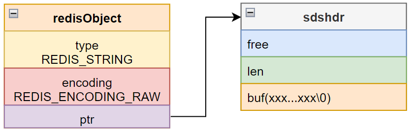
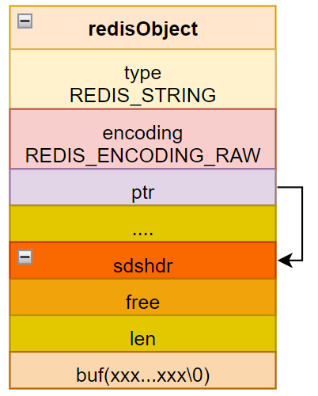
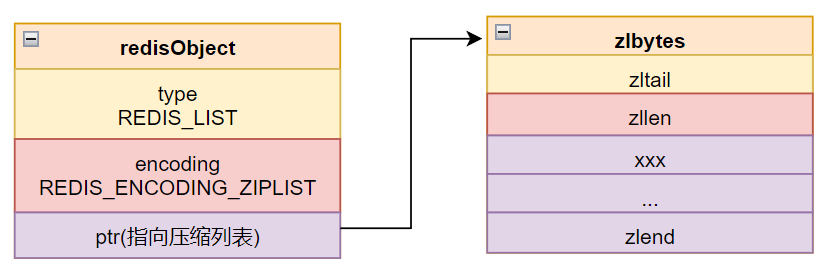
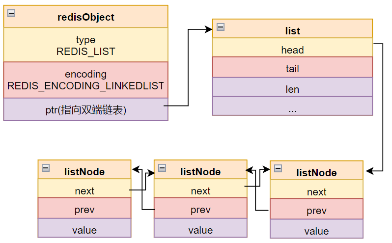
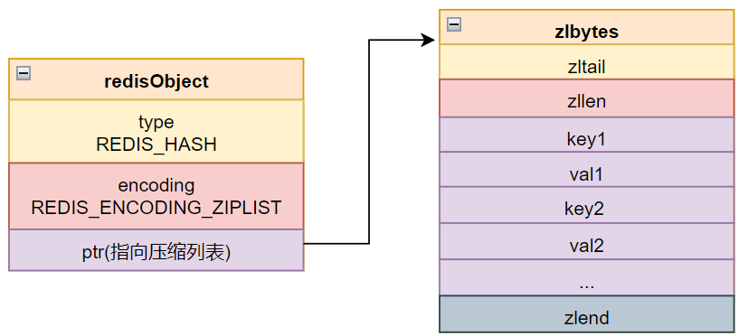
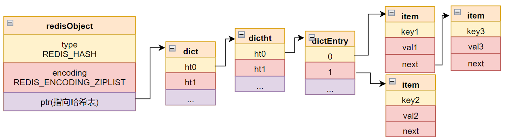
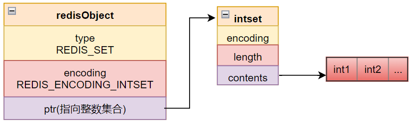
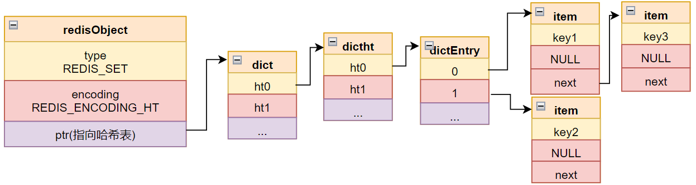
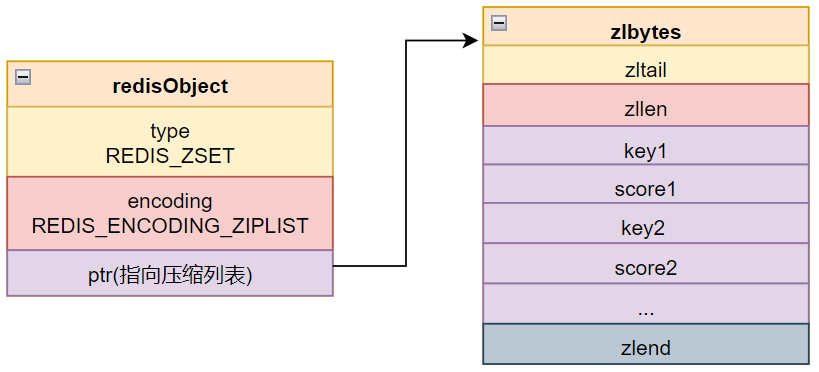
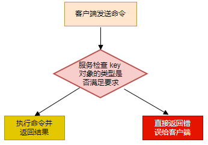

## 对象类型以及编码

redis 中每个键值对都是其实是两个对象，键和值各是一个对象，而每个对象都由一个 redisObject 结构体表示：

```c
typedef struct redisObject {
    // 类型
    unsigned type:4;
    // 编码
    unsigned encoding:4;
    // 指向底层结构的指针
    //void *ptr;
    ...
} robj;
```

### 类型

上面的 type 字段记录对象的具体类型。

redis 中，键肯定都是字符串对象，但值不确定。

type 字段的取值可能如下：

| 类型常量     | 对象名称     | TYPE 输出 |
| :----------- | ------------ | --------- |
| REDIS_STRING | 字符串对象   | string    |
| REDIS_LIST   | 列表对象     | list      |
| REDIS_HASH   | 哈希对象     | hash      |
| REDIS_SET    | 集合对象     | set       |
| REDIS_ZSET   | 有序集合对象 | zset      |

可以使用 TYPE 命令获取一个键的类型：

```shell
127.0.0.1:6379> set msg gold
OK
127.0.0.1:6379> type msg
string
127.0.0.1:6379> rpush array 1 2 3
(integer) 3 
127.0.0.1:6379> type array
list
```


### 编码

redisObject 中的 encoding 表示底层对象的编码方式，通过这个属性，ptr 可以转为正确的类型。

| 类型         | 编码                      | 描述                         | OBJECT ENCODING 输出 |
| ------------ | ------------------------- | ---------------------------- | -------------------- |
| REDIS_STRING | REDIS_ENCODING_INT        | 整数实现的字符串对象         | int                  |
| REDIS_STRING | REDIS_ENCODING_EMBSTR     | embstr 实现的字符串对象      | embstr               |
| REDIS_STRING | REDIS_ENCODING_RAW        | sds 实现的字符串对象         | raw                  |
| REDIS_LIST   | REDIS_ENCODING_ZIPLIST    | 压缩列表实现的列表对象       | hashtable            |
| REDIS_LIST   | REDIS_ENCODING_LINKEDLIST | 双端链表实现的列表对象       | linkedlist           |
| REDIS_HASH   | REDIS_ENCODING_ZIPLIST    | 压缩列表实现的哈希对象       | hashtable            |
| REDIS_HASH   | REDIS_ENCODING_HT         | 字典实现的哈希对象           | hashtable            |
| REDIS_SET    | REDIS_ENCODING_INTSET     | 整数集合实现的集合对象       | intset               |
| REDIS_SET    | REDIS_ENCODING_HT         | 字典实现的集合对象           | hastable             |
| REDIS_ZSET   | REDIS_ENCODING_ZIPLIST    | 压缩列表实现的有序集合对象   | ziplist              |
| REDIS_ZSET   | REDIS_ENCODING_SKIPLIST   | 跳表和字典实现的有序集合对象 | skiplist             |

可以使用 OBJECT ENCODING 获取一个变量底层使用的对象类型：

```shell
127.0.0.1:6379> object encoding msg
"embstr"
127.0.0.1:6379> object encoding array
"quicklist" # 3.2 后新增的类型
```


## 字符串对象

### int 编码的字符串对象

如果一个字符串对象可以使用一个 long 表示，则会直接在 ptr 存储这个值：


### raw 编码的字符串

如果字符串确实不能用 long 表示，而又比较长时，使用这种类型：



这种情况下，会从内存申请一块区域作为 sds 存储的位置，然后用 ptr 指过去。

### embstr 编码的字符串

如果字符串确实不能用 long 表示，但长度又不大某个字节 n，则使用 embstr 编码。




相对于 raw 类型，它最大的特点是 sds 部分和 redisObject 是在连续的内存片存储的。

这里的某个字节 n 在不同的版本中不一样，在 2.8 及以前的版本中不管字符串多小，都是直接创建 sds；在 3.2 及之前使用 39 为分界线；在之后的版本中则是 44.

出现这个分歧，是因为 3.2 之前的版本，sds 结构是确定的，redisObject 占 16 个字节，如果 sdshdr 部分占用 8(sds 头的固定部分) + 39 + 1(\0)，正好是 64 字节；但是在 3.2 之后，sds 进一步分为 5 种，且 embstr 使用 sds8 作为存储结构，这时候的大小就变成 16 + 3(sds8 固定头部) + 44 + 1(\0) ，因此新版本就变成了 44.

```shell
127.0.0.1:6379> set a 111111111111111111111111111111111111111 # 39 个字节
OK
127.0.0.1:6379> object encoding a
"embstr"
127.0.0.1:6379> set a 1111111111111111111111111111111111111111 # 40 个字节
OK
127.0.0.1:6379> object encoding a
"embstr"
127.0.0.1:6379> set a 11111111111111111111111111111111111111111111 # 44 个字节
OK
127.0.0.1:6379> object encoding a
"embstr"
127.0.0.1:6379> set a 111111111111111111111111111111111111111111111 # 45 个字节
OK
127.0.0.1:6379> object encoding a
"raw"
```

#### 使用 embstr 的好处

embstr 相比 raw ，有以下好处：

- 创建一个 embstr 对象，只申请一次内存片，而创建一个 raw ，需要申请两次；
- 既然创建只需要申请一次，则释放时也只需要释放一次；
- 有利于缓存；这涉及到 cpu 为加速从内存获取数据的速率而使用的各级 cache，连续一块内存提前被某一级 cache 的概率比分片的两块更大；

#### 浮点数的保存

浮点数保存时，也是使用 embstr 或 raw 保存的，如果执行数学计算，会先进行转换，计算完成后再转换成 raw 或 embstr；但是这个过程可能会发生精度问题，而且由于浮点数的有效大小因素，转换后基本都是 embstr：

```shell
127.0.0.1:6379> set pi 3.14111111111111111111111111111111111111111111111
OK
127.0.0.1:6379> object encoding pi
"raw"
127.0.0.1:6379> incrbyfloat pi 1.25
"4.39111111111111111"
127.0.0.1:6379> object encoding pi
"embstr"
127.0.0.1:6379> set pi 3.14
OK
127.0.0.1:6379> incrbyfloat pi 1.2511111111111111111111111111111111111111111111111
"4.39111111111111111"
127.0.0.1:6379> object encoding pi
```

### 编码类型的转换

int 类型执行数学计算时，除非溢出，否则不会发生类型变化；但如果执行  append 等字符串的操作，哪怕最终不溢出，其结果也是 raw, 连 embstr 都不是：

```shell
127.0.0.1:6379> set a 111
OK
127.0.0.1:6379> append a 222
(integer) 6
127.0.0.1:6379> object encoding a
"raw"
```

对于 embstr 来说，没有任何写操作的接口，只要是写操作，都会先转为 raw，再执行操作，即 embstr 一旦执行了写操作，就再也回不去了。


## 列表对象

列表对象根据情况选择使用压缩列表或者双端链表。

### 压缩列表



### 双端链表



### 编码类型转换

当列表中有一个字符串大小超过一定字节或者元素总数超过一定数量，列表就会由压缩列表转为双端链表，这是由双端链表更占用空间以及其存储结构决定的。


## 哈希对象

哈希对象使用压缩表或者哈希表实现。

### 压缩列表



当使用压缩列表表示哈希对象时，每个键值对的键和值会紧密排列在一起。

### 哈希表



以哈希表实现哈希对象时，哈希表中每个键是一个字符串，保存键本身的值，每个值也是一个字符串，表示键对应的值；


### 编码类型转换

同样，当所有键值对的键和值都小于一定字节数且总对象数小于一定数值时，使用压缩列表，否则会由压缩列表转为哈希表。


## 集合对象

集合对象使用 intset 或者 hashtable 实现。

### 整数集合



当集合中的元素都是整数且总元素数不超过一定大小时，就使用 intset 作为集合的底层数据结构。

### 哈希表

使用哈希表表示集合时，字典的值全部是 NULL。



## 有序集合对象

有序集合使用 ziplist 或 skiplist 实现。

### 压缩列表

使用压缩列表实现有序集合时，集合中成员和值类似于在哈希对象中一样，紧挨在一起；而且整个压缩列表中的成员/分值对都会按照分值从小到大有序排列。



### skiplist

skiplist 是一种组合形成的复杂结构：

```c
typedef struct zset{
    zskiplist *zsl;
    dict *dict;
}zset;
```

可以看到，一个 skiplist 中，既有一个指向字典的指针，也有一个指向跳表的指针，即一个 skiplist 包含了两种基础的数据结构。

之所以出现这种情况，是因为有序列表有两个基础的使用场景：

1. 查找指定分值范围的成员；
2. 查找指定成员的分数；

如果使用跳表，1 的操作会很快，但 2 的操作非常慢；如果使用哈希表，又是反过来的。所以 redis 实现有序集合时，同时使用了这两种数据结构，并且在内部通过指针共享对象，避免空间浪费。


## 多态

由于一个 redis 对象可能是以上 5 种中的任意一种，而很多命令只能针对特定类型使用，因此 redis 在执行命令时，必须对对象类型先进行判断，如果类型符合，就执行，否则会返回给客户端错误：

### 类型检查

当 redis 收到对指定键的操作命令时，会先根据对象的 type 和 encoding 字段判断键是否符合命令的需求，如果需求才会执行命令，否则直接返回错误给客户端：

