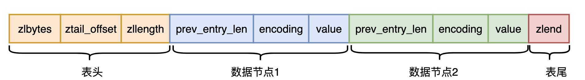

## 压缩列表

压缩列表虽然名为列表，但它与我们正常使用的列表有很大区别；我们一般使用的列表，每个元素在列表中占用的字节数是固定的，因此查找和更改指定索引处的元素会很快；但是处理元素大小可变的情况，如果使用列表，往往不得不按照最极端的情况设置单一元素的大小，这时就非常容易出现各种碎片的情况；redis 中的压缩列表是一种很紧凑的数据结构，它每个列表元素占用的大小是不固定的，单一元素大小会进行存储，但这就使得按索引获取元素以及插入、删除等操作变得更复杂。

### 结构体定义

#### 列表整体结构体定义

下面是压缩列表的整体结构。



- zlbytes ，32 位无符号整数，表示当前 ziplist 占用的总字节数；

- zltail，32 位无符号整数，ziplist 最后一个 entry 的头相对于 ziplist 最开始的偏移量，通过它，不需要完全遍历 ziplist 就可以直接跳转到最后一项；

- zllen，16 位 无符号整数，ziplist 的 entry 数量；当 zllen 比 2**16-2 大时，zllen数值不准确，需要完全遍历 entry 列表来获取 entry 的总数目；

- zlend，单字节的特殊值，等于255，标识着 ziplist 结束；

- prev_entry_len, 压缩表中，每一项都会存储前一项 entry 的长度，这部分可能占 1 字节，可能占 5 字节；当前面一项 entry 长小于 254 时，占用 1 字节；否则占用 5 字节，其中第 1 个字节固定为 254，实际长度用后面 4 字节表示；之所以是 254 而不是 255，因为 255 在跳表中表示 zlend；通过这个属性值，再加上 zltail,  压缩表中可以很方便的实现逆序遍历；

- encoding,  可能占用 1、2、5 字节：

  | 编码                                                | 占用字节数 | 含义                                                         |
  | --------------------------------------------------- | ---------- | ------------------------------------------------------------ |
  | 00bbbbbb                                            | 1 字节     | value 表示长度不超过 63 字节的字节数组                       |
  | 01bbbbbb xxxxxxxx                                   | 2 字节     | value 表示长度不超过 16383 字节的字节数组                    |
  | 10\_\_\_\_\_\__ aaaaaaaa bbbbbbbb cccccccc dddddddd | 5 字节     | value 表示长度不超过 2<sup>32</sup> - 1 字节的字节数组       |
  | 11000000                                            | 1 字节     | value 表示 int16_t 整数                                      |
  | 11010000                                            | 1 字节     | value 表示 int32_t 整数                                      |
  | 11100000                                            | 1 字节     | value 表示 int64_t 整数                                      |
  | 11110000                                            | 1 字节     | value 表示 24 位有符号整数                                   |
  | 11111110                                            | 1 字节     | value 表示 8 位有符号整数                                    |
  | 1111xxxx                                            | 1 字节     | 此时没有 content，值存储在 xxxx 部分；而且只存储 0001-1101, 表示 0-12. |

- value，这一项 entry 实际的内容；实际内容由 encoding 进行解释；prev_entry_len、encoding、value 共同组成一项 entry；

#### 列表元素

```c
typedef struct zlentry {
    unsigned int prevrawlensize, prevrawlen;
    unsigned int lensize, len;
    unsigned int headersize;
    unsigned char encoding;
    unsigned char *p;
} zlentry;
```

上面是单一元素的定义，但要注意，这个结构体并不与上面 entry 各字段对应，而是为了方便对压缩表进行操作，各字段含义如下：

- prevrawlensize, 是指 prev_entry_len 占用字节的大小，它的值只有 1 和 5；；
- prevrawlen,  前一节点实际占用的字节数量； 
- lensize, 编码本项 entry 长度所需的字节大小，它的值有 1 2 和 5 三种情况;
- len, 当前项 value 占用字节数;
- headersize, 当前节点大小，prevrawlensize+lensize，它主要是对压缩表每一项进行操作时，方便计算；
- encoding, 节点编码方式；
- p, 指向节点的指针，即对应 entry 的 prev_entry_len 开始的地方；


